## AWS Highly Available Web Application 

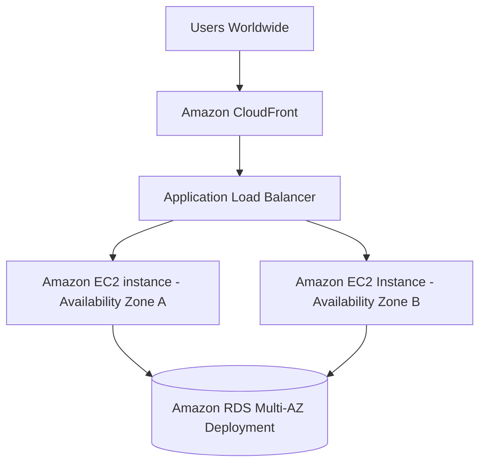
```mermaid
graph TD

A[Users Worldwide]
B[Amazon CloudFront]
C[Application Load Balancer]
D[Amazon EC2 instance - Availability Zone A]
E[Amazon EC2 Instance - Availability Zone B]
F[(Amazon RDS Multi-AZ Deployment)]

A --> B
B --> C
C --> D
C --> E
D --> F
E --> F
```

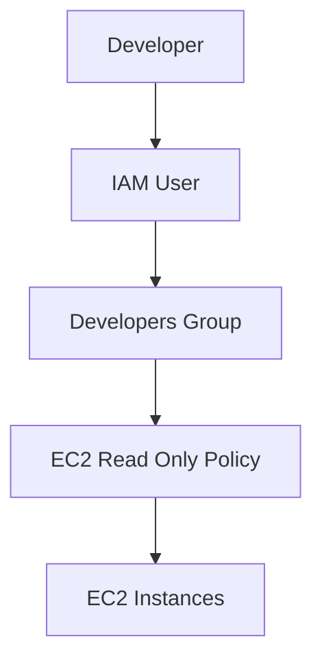
```mermaid
flowchart TD

User[Developer]

User --> IAM[IAM User]

IAM --> Group[Developers Group]

Group --> Policy[EC2 Read Only Policy]

Policy --> AWS[EC2 Instances]
```

```mermaid
flowchart TD

User[Developer]

User --> IAM[IAM User]

IAM --> Group[Developers Group]

Group --> Policy[EC2 Read Only Policy]

Policy --> AWS[EC2 Instances]
```

## AWS Auto Scaling Groups

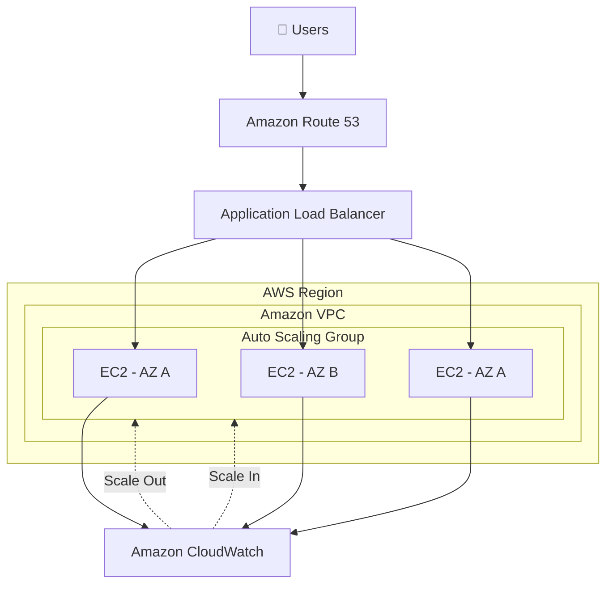
```mermaid
flowchart TD

    U[👥 Users]
    DNS[Amazon Route 53]
    ALB[Application Load Balancer]

    subgraph AWS["AWS Region"]

        subgraph VPC["Amazon VPC"]

            subgraph ASG["Auto Scaling Group"]

                EC1[EC2 - AZ A]
                EC2[EC2 - AZ B]
                EC3[EC2 - AZ A]

            end

        end

    end

    CW[Amazon CloudWatch]

    U --> DNS
    DNS --> ALB

    ALB --> EC1
    ALB --> EC2
    ALB --> EC3

    EC1 --> CW
    EC2 --> CW
    EC3 --> CW

    CW -. Scale Out .-> ASG
    CW -. Scale In .-> ASG
```

Diagram 1 – ALB + ASG

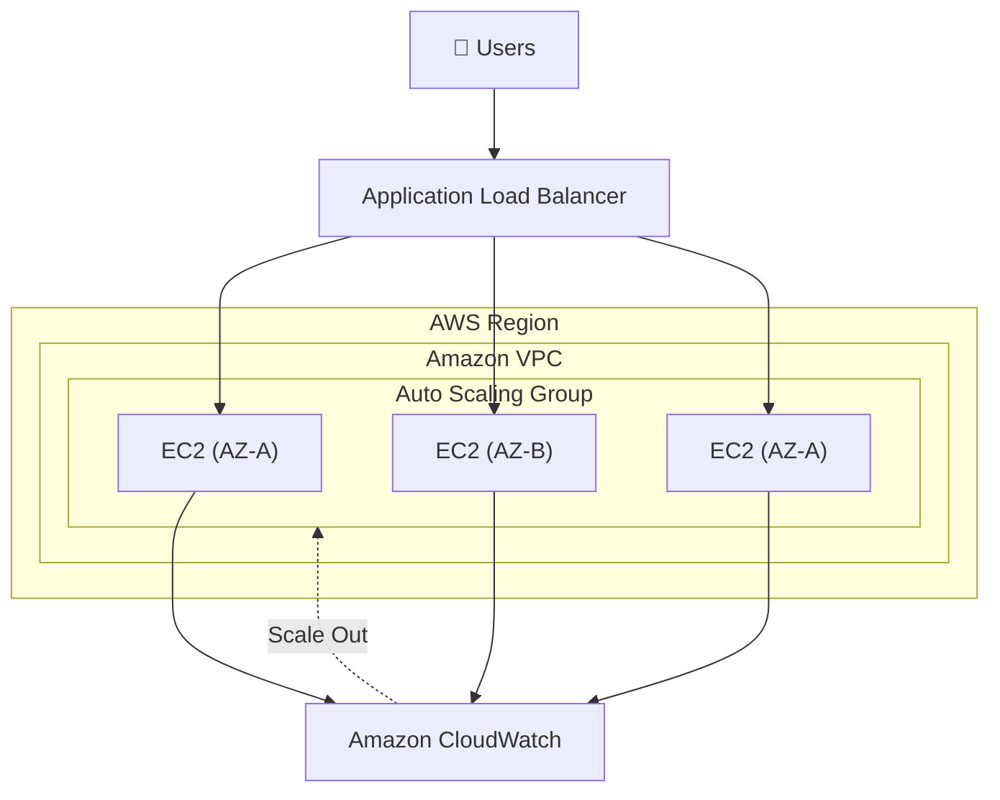
```mermaid
flowchart TD

    U[👥 Users]
    ALB[Application Load Balancer]

    subgraph AWS["AWS Region"]

        subgraph VPC["Amazon VPC"]

            subgraph ASG["Auto Scaling Group"]

                EC1["EC2 (AZ-A)"]
                EC2["EC2 (AZ-B)"]
                EC3["EC2 (AZ-A)"]

            end

        end

    end

    CW["Amazon CloudWatch"]

    U --> ALB

    ALB --> EC1
    ALB --> EC2
    ALB --> EC3

    EC1 --> CW
    EC2 --> CW
    EC3 --> CW

    CW -. Scale Out .-> ASG
```

Diagram 2 – ALB Health Check

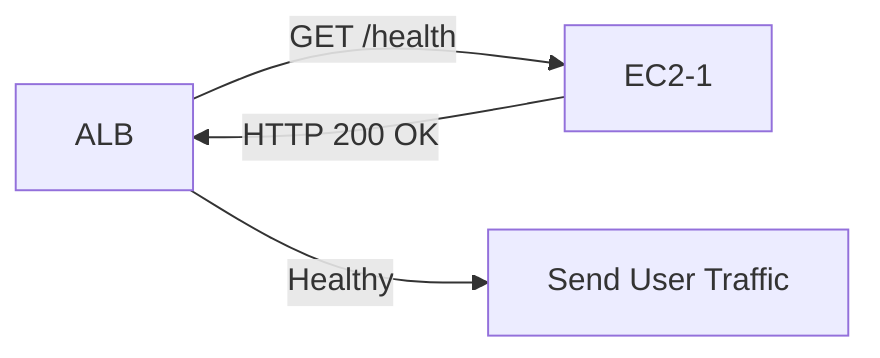
```mermaid
flowchart LR

ALB -->|"GET /health"| EC1["EC2-1"]

EC1 -->|"HTTP 200 OK"| ALB

ALB -->|"Healthy"| USERS[Send User Traffic]
```

Diagram 3 – Regional DR

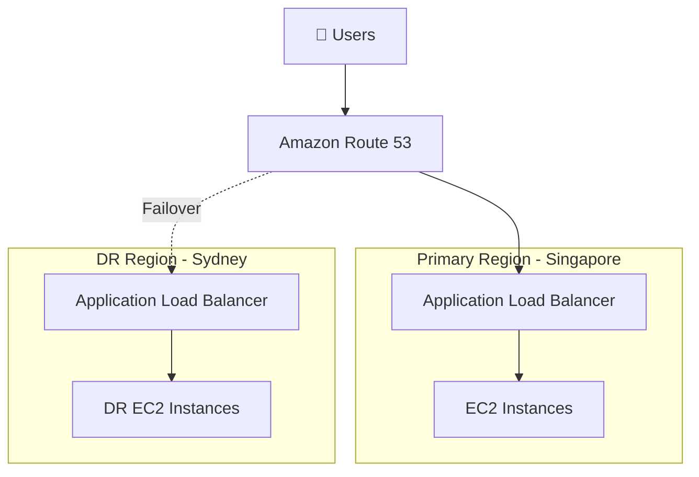
```mermaid
flowchart TD

    Users[👥 Users]
    Route53[Amazon Route 53]

    subgraph Primary["Primary Region - Singapore"]
        ALB1[Application Load Balancer]
        EC2A[EC2 Instances]
        ALB1 --> EC2A
    end

    subgraph DR["DR Region - Sydney"]
        ALB2[Application Load Balancer]
        EC2B[DR EC2 Instances]
        ALB2 --> EC2B
    end

    Users --> Route53
    Route53 --> ALB1

    Route53 -. "Failover" .-> ALB2
```

**A. ALB + Target Groups**

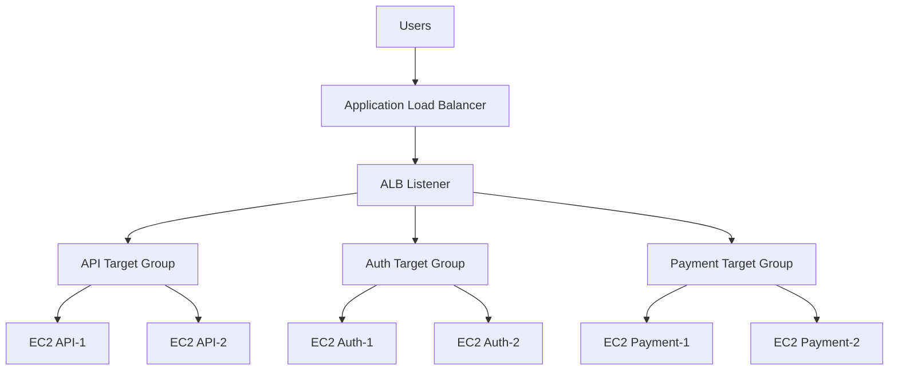
```mermaid
flowchart TD

    Users[Users]

    ALB[Application Load Balancer]
    Listener[ALB Listener]

    API[API Target Group]
    AUTH[Auth Target Group]
    PAYMENT[Payment Target Group]

    API1[EC2 API-1]
    API2[EC2 API-2]

    AUTH1[EC2 Auth-1]
    AUTH2[EC2 Auth-2]

    PAY1[EC2 Payment-1]
    PAY2[EC2 Payment-2]

    Users --> ALB
    ALB --> Listener

    Listener --> API
    Listener --> AUTH
    Listener --> PAYMENT

    API --> API1
    API --> API2

    AUTH --> AUTH1
    AUTH --> AUTH2

    PAYMENT --> PAY1
    PAYMENT --> PAY2

```

**B. Path-Based Routing**

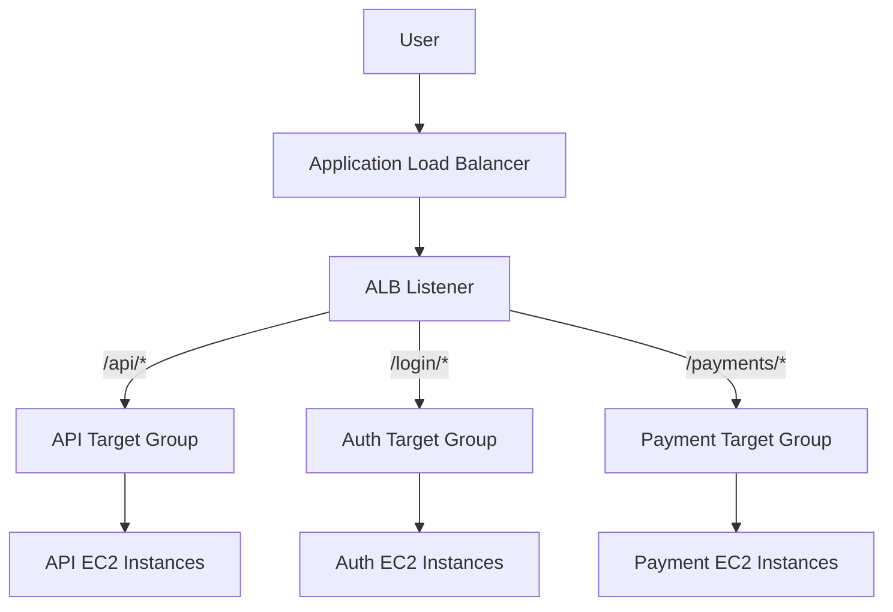
```mermaid

flowchart TD

    User[User]
    ALB[Application Load Balancer]
    Listener[ALB Listener]

    API[API Target Group]
    AUTH[Auth Target Group]
    PAYMENT[Payment Target Group]

    APIEC2[API EC2 Instances]
    AUTHEC2[Auth EC2 Instances]
    PAYEC2[Payment EC2 Instances]

    User --> ALB
    ALB --> Listener

    Listener -->|"/api/*"| API
    Listener -->|"/login/*"| AUTH
    Listener -->|"/payments/*"| PAYMENT

    API --> APIEC2
    AUTH --> AUTHEC2
    PAYMENT --> PAYEC2

```

**C. Host-Based Routing**

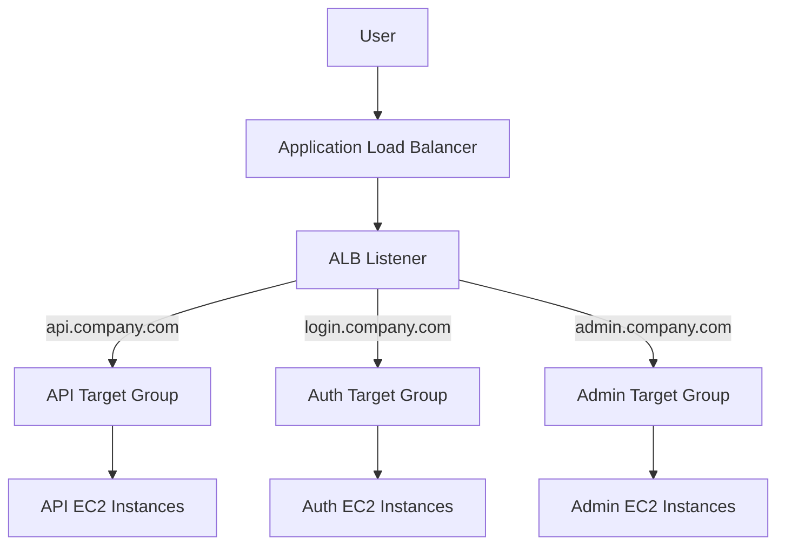
```mermaid
flowchart TD

    User[User]
    ALB[Application Load Balancer]
    Listener[ALB Listener]

    API[API Target Group]
    AUTH[Auth Target Group]
    ADMIN[Admin Target Group]

    APIEC2[API EC2 Instances]
    AUTHEC2[Auth EC2 Instances]
    ADMINEC2[Admin EC2 Instances]

    User --> ALB
    ALB --> Listener

    Listener -->|"api.company.com"| API
    Listener -->|"login.company.com"| AUTH
    Listener -->|"admin.company.com"| ADMIN

    API --> APIEC2
    AUTH --> AUTHEC2
    ADMIN --> ADMINEC2

```

**D. Blue/Green Deployment**

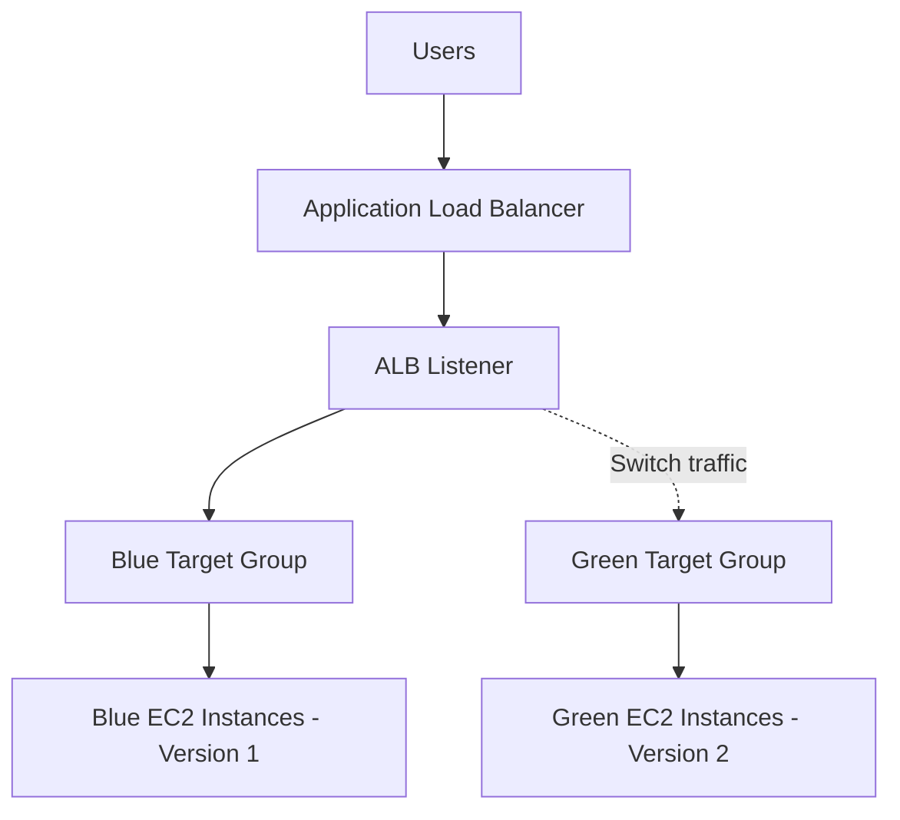
```mermaid
flowchart TD

    Users[Users]
    ALB[Application Load Balancer]
    Listener[ALB Listener]

    BLUE[Blue Target Group]
    GREEN[Green Target Group]

    BLUEEC2[Blue EC2 Instances - Version 1]
    GREENEC2[Green EC2 Instances - Version 2]

    Users --> ALB
    ALB --> Listener

    Listener --> BLUE
    Listener -. "Switch traffic" .-> GREEN

    BLUE --> BLUEEC2
    GREEN --> GREENEC2

```

---

# 2. `architecture/aws/README.md`

Add this section:

## CloudFront Architecture

### A. CloudFront + S3

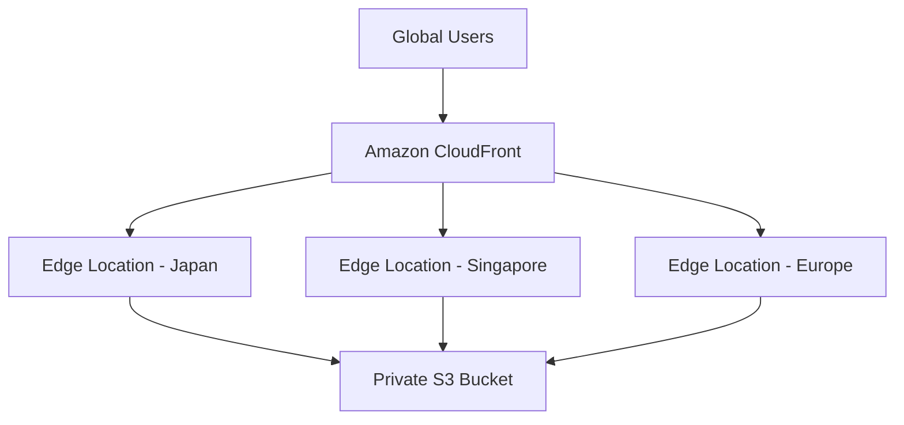
```mermaid
flowchart TD

    Users[Global Users]

    CF[Amazon CloudFront]

    Edge1[Edge Location - Japan]
    Edge2[Edge Location - Singapore]
    Edge3[Edge Location - Europe]

    S3[Private S3 Bucket]

    Users --> CF

    CF --> Edge1
    CF --> Edge2
    CF --> Edge3

    Edge1 --> S3
    Edge2 --> S3
    Edge3 --> S3

```

**B. CloudFront + ALB + ASG**

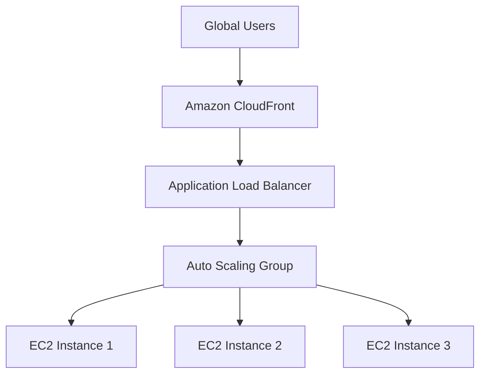
```mermaid
flowchart TD

    Users[Global Users]

    CF[Amazon CloudFront]

    ALB[Application Load Balancer]

    ASG[Auto Scaling Group]

    EC1[EC2 Instance 1]
    EC2[EC2 Instance 2]
    EC3[EC2 Instance 3]

    Users --> CF
    CF --> ALB
    ALB --> ASG

    ASG --> EC1
    ASG --> EC2
    ASG --> EC3

```

**C. CloudFront Static + Dynamic Content**
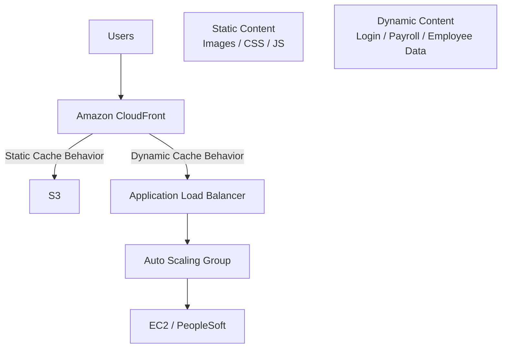
```mermaid
flowchart TD

    Users[Users]

    CF[Amazon CloudFront]

    Static[Static Content<br/>Images / CSS / JS]
    Dynamic[Dynamic Content<br/>Login / Payroll / Employee Data]

    S3[S3]
    ALB[Application Load Balancer]
    ASG[Auto Scaling Group]
    EC2[EC2 / PeopleSoft]

    Users --> CF

    CF -->|Static Cache Behavior| S3
    CF -->|Dynamic Cache Behavior| ALB

    ALB --> ASG
    ASG --> EC2

```

**D. CloudFront + Private S3 + OAC**
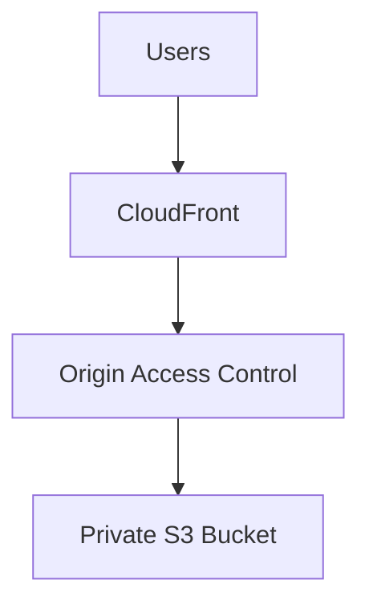
```mermaid
flowchart TD

    Users[Users]

    CF[CloudFront]

    OAC[Origin Access Control]

    S3[Private S3 Bucket]

    Users --> CF
    CF --> OAC
    OAC --> S3

```

A. Route 53 + ALB
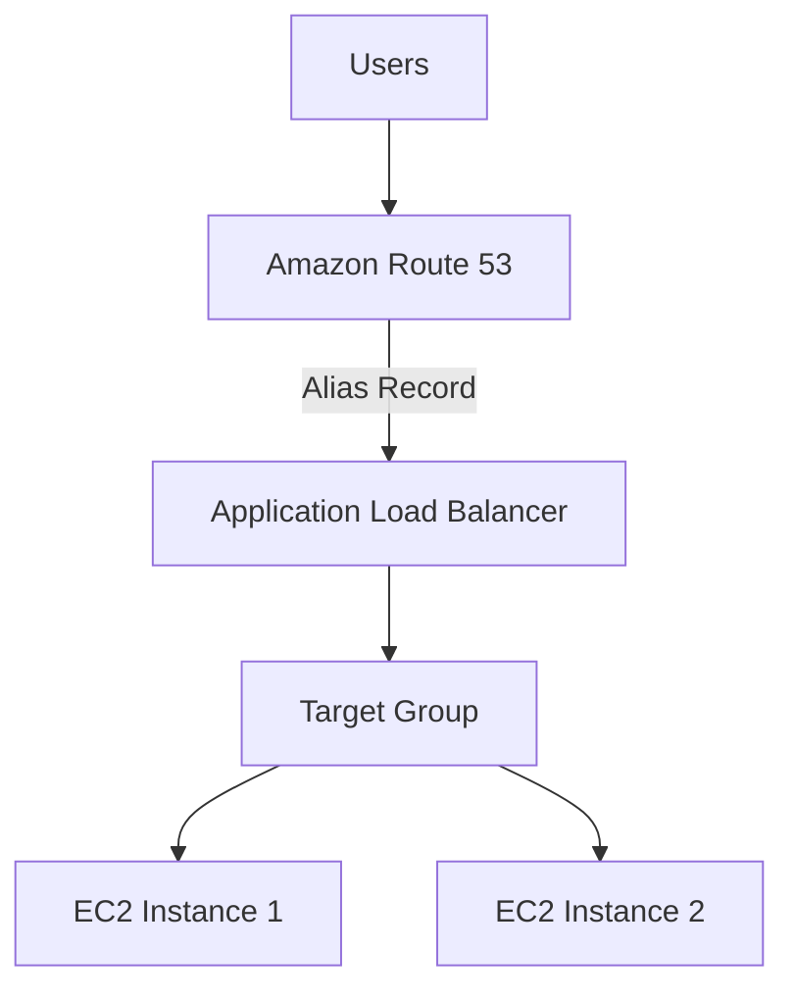
```mermaid
flowchart TD

    Users[Users]

    R53[Amazon Route 53]

    ALB[Application Load Balancer]

    TG[Target Group]

    EC1[EC2 Instance 1]
    EC2[EC2 Instance 2]

    Users --> R53
    R53 -->|Alias Record| ALB
    ALB --> TG
    TG --> EC1
    TG --> EC2

```

B. Route 53 + CloudFront + ALB

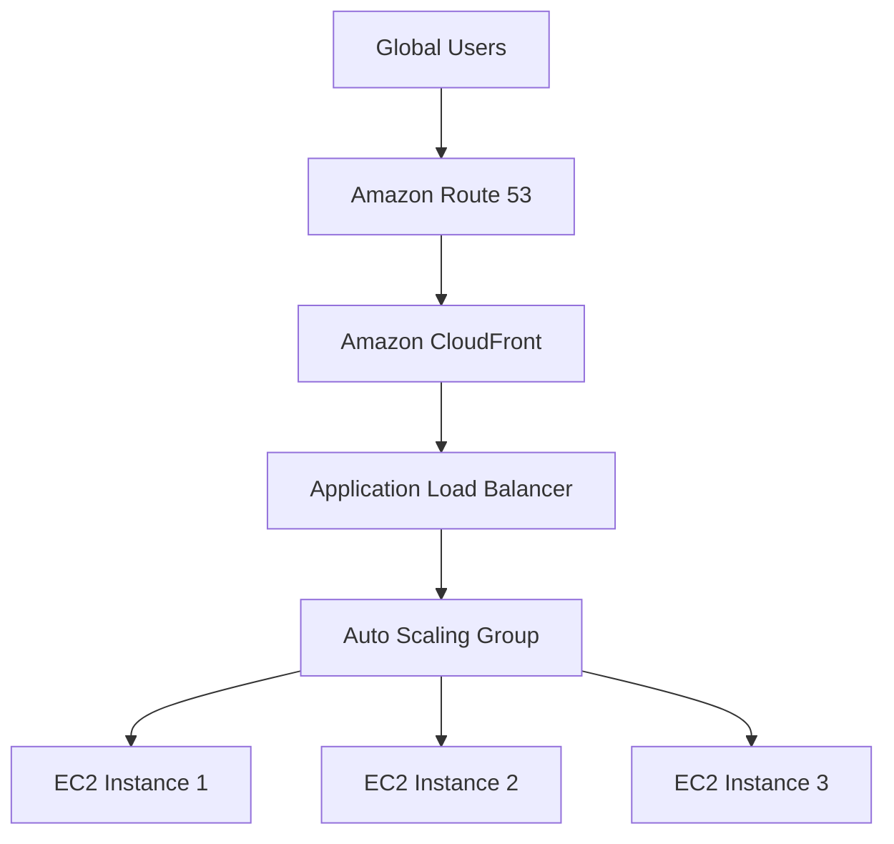
```mermaid

flowchart TD

    Users[Global Users]

    R53[Amazon Route 53]

    CF[Amazon CloudFront]

    ALB[Application Load Balancer]

    ASG[Auto Scaling Group]

    EC1[EC2 Instance 1]
    EC2[EC2 Instance 2]
    EC3[EC2 Instance 3]

    Users --> R53
    R53 --> CF
    CF --> ALB
    ALB --> ASG

    ASG --> EC1
    ASG --> EC2
    ASG --> EC3
```

C. Route 53 Failover Routing

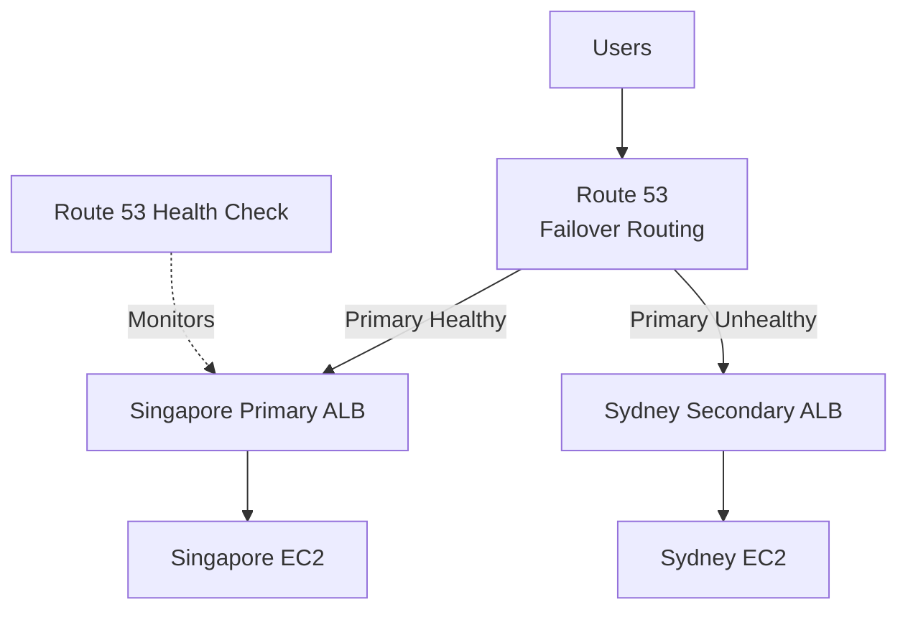
```mermaid
flowchart TD

    Users[Users]

    R53[Route 53<br/>Failover Routing]

    Health[Route 53 Health Check]

    SG[Singapore Primary ALB]
    SY[Sydney Secondary ALB]

    SGEC2[Singapore EC2]
    SYEC2[Sydney EC2]

    Users --> R53

    Health -. Monitors .-> SG

    R53 -->|Primary Healthy| SG
    R53 -->|Primary Unhealthy| SY

    SG --> SGEC2
    SY --> SYEC2

```

D. Route 53 Weighted Routing

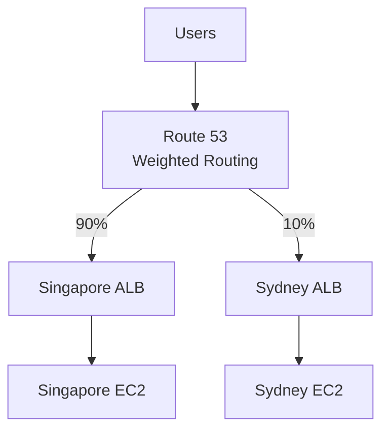
```mermaid
flowchart TD

    Users[Users]

    R53[Route 53<br/>Weighted Routing]

    SG[Singapore ALB]
    SY[Sydney ALB]

    SGEC2[Singapore EC2]
    SYEC2[Sydney EC2]

    Users --> R53

    R53 -->|90%| SG
    R53 -->|10%| SY

    SG --> SGEC2
    SY --> SYEC2
```

E. Route 53 Latency-Based Routing

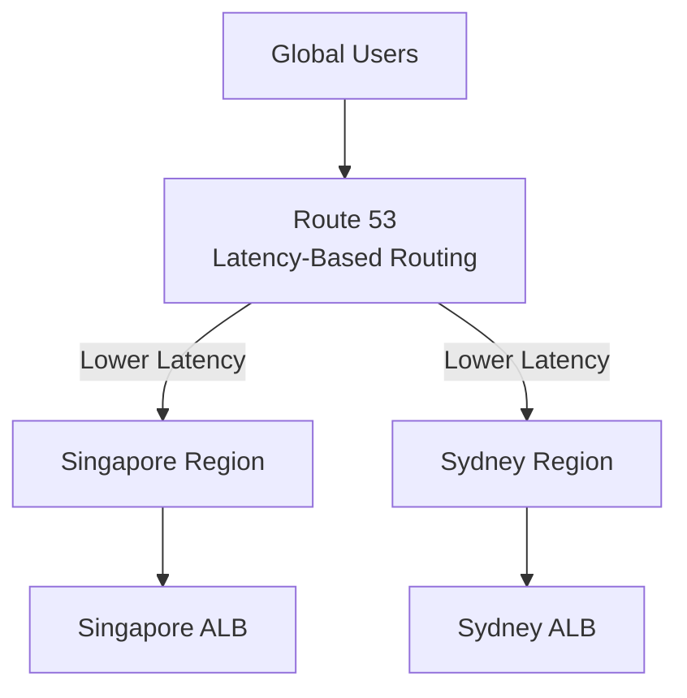
```mermaid

flowchart TD

    Users[Global Users]

    R53[Route 53<br/>Latency-Based Routing]

    SG[Singapore Region]
    SY[Sydney Region]

    SGALB[Singapore ALB]
    SYALB[Sydney ALB]

    Users --> R53

    R53 -->|Lower Latency| SG
    R53 -->|Lower Latency| SY

    SG --> SGALB
    SY --> SYALB
```

F. Route 53 Geolocation Routing

```mermaid

flowchart TD

    Users[Global Users]

    R53[Route 53<br/>Geolocation Routing]

    SG[Singapore Application]
    JP[Japan Application]
    UK[UK Application]

    Users --> R53

    R53 -->|Singapore Users| SG
    R53 -->|Japan Users| JP
    R53 -->|UK Users| UK

```

S3 + CloudFront + OAC

```mermaid

flowchart TD

    Users[Global Users]
    R53[Amazon Route 53]
    CF[Amazon CloudFront]
    S3[Private S3 Bucket]

    Users --> R53
    R53 --> CF
    CF -->|Authorized using OAC| S3
```

S3 Lifecycle Architecture

```mermaid

flowchart LR

    Standard[S3 Standard<br/>0-30 Days]
    IA[S3 Standard-IA<br/>After 30 Days]
    Glacier[S3 Glacier<br/>After 365 Days]
    Delete[Expire / Delete<br/>After 7 Years]

    Standard -->|Lifecycle Transition| IA
    IA -->|Lifecycle Transition| Glacier
    Glacier -->|Lifecycle Expiration| Delete

```

S3 Cross-Region Replication

```mermaid

flowchart LR

    SG[S3 Bucket<br/>Singapore Region<br/>Versioning Enabled]
    SY[S3 Bucket<br/>Sydney Region<br/>Versioning Enabled]

    SG -->|Cross-Region Replication - CRR| SY

```

Secure EC2 + S3 Architecture

```mermaid

flowchart TD

    App[Application]
    EC2[Amazon EC2]
    Role[IAM Role<br/>Least-Privilege S3 Permissions]
    S3[Private S3 Bucket]
    BPA[Block Public Access]
    KMS[SSE-KMS Encryption]
    Versioning[S3 Versioning]

    App --> EC2
    EC2 --> Role
    Role -->|s3:GetObject| S3

    S3 --- BPA
    S3 --- KMS
    S3 --- Versioning

```

S3 Versioning

```mermaid

flowchart TD

    Object[report.pdf]

    V1[Version 1]
    V2[Version 2]
    V3[Version 3 - Current]
    DM[Delete Marker]

    Object --> V1
    Object --> V2
    Object --> V3
    V3 -->|Normal Delete| DM

```

**RDS Multi-AZ**

```mermaid
flowchart TD

    APP[Application]
    ENDPOINT[RDS DNS Endpoint]
    PRIMARY[Primary RDS<br/>AZ-A]
    STANDBY[Standby RDS<br/>AZ-B]

    APP --> ENDPOINT
    ENDPOINT --> PRIMARY
    PRIMARY -->|Synchronous Replication| STANDBY
    STANDBY -. Automatic Failover .-> ENDPOINT
```

**Multi-AZ + Read Replica**

```mermaid
flowchart TD

    APP[Application]

    PRIMARY[Primary RDS<br/>AZ-A]
    STANDBY[Multi-AZ Standby<br/>AZ-B]
    REPLICA[Read Replica]

    APP -->|Writes| PRIMARY
    APP -->|Reads| REPLICA

    PRIMARY -->|Synchronous Replication| STANDBY
    PRIMARY -->|Asynchronous Replication| REPLICA
```

**Secure Application + RDS**

```mermaid

flowchart TD

    USERS[Users]
    R53[Amazon Route 53]
    ALB[Internet-Facing ALB<br/>Public Subnets]
    ASG[Auto Scaling Group]
    EC2[EC2 Application Servers<br/>Private Subnets<br/>APP-SG]
    ENDPOINT[RDS DNS Endpoint]
    RDS[Amazon RDS Multi-AZ<br/>Private DB Subnets<br/>DB-SG]
    KMS[AWS KMS]

    USERS --> R53
    R53 --> ALB
    ALB --> ASG
    ASG --> EC2
    EC2 -->|DB Port<br/>APP-SG to DB-SG| ENDPOINT
    ENDPOINT --> RDS
    KMS -->|Encryption at Rest| RDS

```

**RDS Proxy**

```mermaid
flowchart TD

    L1[Lambda]
    L2[Lambda]
    L3[Lambda]
    L4[Lambda]

    PROXY[Amazon RDS Proxy<br/>Connection Pool]

    RDS[Amazon RDS]

    L1 --> PROXY
    L2 --> PROXY
    L3 --> PROXY
    L4 --> PROXY

    PROXY -->|Reused DB Connections| RDS

```

**RDS Backup and PITR**

```mermaid
flowchart LR

    RDS[Production RDS]
    BACKUP[Automated Backups<br/>+ Transaction Logs]
    PITR[Point-in-Time Recovery]
    NEWDB[New RDS DB Instance]

    RDS --> BACKUP
    BACKUP --> PITR
    PITR -->|Restore to Selected Time| NEWDB

```

Public and Private Subnets + NAT

```mermaid

flowchart TD

    Internet[Internet]
    IGW[Internet Gateway]

    Public[Public Subnet]
    NAT[NAT Gateway]

    Private[Private App Subnet]
    EC2[EC2 Application]

    Internet <--> IGW
    IGW <--> Public
    Public --> NAT
    Private --> EC2
    EC2 --> NAT

```

Multi-AZ NAT Architecture

```mermaid

flowchart TD

    Internet[Internet]
    IGW[Internet Gateway]

    PubA[Public Subnet A - AZ-A]
    PubB[Public Subnet B - AZ-B]

    NATA[NAT Gateway A]
    NATB[NAT Gateway B]

    PrivA[Private App Subnet A]
    PrivB[Private App Subnet B]

    EC2A[EC2-A]
    EC2B[EC2-B]

    Internet <--> IGW

    IGW --> PubA
    IGW --> PubB

    PubA --> NATA
    PubB --> NATB

    PrivA --> EC2A
    PrivB --> EC2B

    EC2A --> NATA
    EC2B --> NATB

```

S3 Gateway Endpoint

```mermaid

flowchart LR

    EC2[EC2 - Private Subnet]
    Endpoint[S3 Gateway VPC Endpoint]
    S3[Amazon S3]

    EC2 --> Endpoint
    Endpoint --> S3

```

Interface Endpoint

```mermaid

flowchart LR

    EC2[EC2 - Private Subnet]
    Endpoint[Interface VPC Endpoint<br/>ENI + Private IP]
    PL[AWS PrivateLink]
    Service[AWS Service]

    EC2 --> Endpoint
    Endpoint --> PL
    PL --> Service

```

VPC Peering

```mermaid

flowchart LR

    VPCA[VPC-A<br/>10.0.0.0/16]
    Peer[VPC Peering Connection]
    VPCB[VPC-B<br/>10.1.0.0/16]

    VPCA <--> Peer
    Peer <--> VPCB

```

Transit Gateway

```mermaid
flowchart TD

    TGW[AWS Transit Gateway]

    A[VPC-A]
    B[VPC-B]
    C[VPC-C]
    D[VPC-D]
    E[VPC-E]

    A --> TGW
    B --> TGW
    C --> TGW
    D --> TGW
    E --> TGW
```

Production Multi-AZ VPC

```mermaid

flowchart TD

    Users[Internet Users]
    IGW[Internet Gateway]
    ALB[Application Load Balancer]

    PubA[Public Subnet A - AZ-A]
    PubB[Public Subnet B - AZ-B]

    NATA[NAT Gateway A]
    NATB[NAT Gateway B]

    AppA[EC2 App - AZ-A<br/>APP-SG]
    AppB[EC2 App - AZ-B<br/>APP-SG]

    S3EP[S3 Gateway Endpoint]
    S3[Amazon S3]

    RDS[RDS Multi-AZ<br/>Private DB Subnets<br/>DB-SG]

    Users --> IGW
    IGW --> ALB

    ALB --> AppA
    ALB --> AppB

    AppA --> NATA
    AppB --> NATB

    NATA --> PubA
    NATB --> PubB

    AppA --> S3EP
    AppB --> S3EP
    S3EP --> S3

    AppA -->|DB Port| RDS
    AppB -->|DB Port| RDS

```
**CloudWatch Monitoring Architecture**
```mermaid

flowchart TD

    EC2[EC2]
    ALB[Application Load Balancer]
    RDS[Amazon RDS]

    Agent[CloudWatch Agent]
    Metrics[CloudWatch Metrics]
    Logs[CloudWatch Logs]

    Alarm[CloudWatch Alarm]
    SNS[Amazon SNS]
    OPS[Operations Team]

    EC2 -->|CPU / Network| Metrics
    EC2 --> Agent

    Agent -->|Memory / OS Metrics| Metrics
    Agent -->|Application Logs| Logs

    ALB -->|ALB Metrics| Metrics
    RDS -->|RDS Metrics| Metrics

    Metrics --> Alarm
    Alarm --> SNS
    SNS --> OPS
```

**CloudWatch Logs Metric Filter**
```mermaid
flowchart LR

    APP[Application]
    AGENT[CloudWatch Agent]
    LOGS[CloudWatch Logs]
    FILTER[Metric Filter<br/>Pattern: ERROR]
    METRIC[CloudWatch Metric<br/>ErrorCount]
    ALARM[CloudWatch Alarm]
    SNS[Amazon SNS]
    OPS[Operations Team]

    APP --> AGENT
    AGENT --> LOGS
    LOGS --> FILTER
    FILTER --> METRIC
    METRIC --> ALARM
    ALARM --> SNS
    SNS --> OPS
```

**CloudWatch vs CloudTrail**

```mermaid

flowchart TD

    RESOURCE[AWS Resources]
    ACTIVITY[AWS API Activity]

    CW[Amazon CloudWatch]
    CT[AWS CloudTrail]

    RESOURCE -->|Metrics / Logs| CW
    ACTIVITY -->|API Activity| CT

    CW --> HEALTH[Performance / Health]
    CT --> AUDIT[Who / What / When]
```

**Production Observability**

```mermaid
flowchart TD

    ALB[ALB]
    EC2[EC2 Auto Scaling Group]
    RDS[RDS]

    AGENT[CloudWatch Agent]

    CW[CloudWatch Metrics]
    LOGS[CloudWatch Logs]

    ALARM[CloudWatch Alarm]
    SNS[Amazon SNS]
    OPS[Operations Team]

    DASH[CloudWatch Dashboard]
    TRAIL[AWS CloudTrail]

    ALB --> CW

    EC2 -->|CPU / Network| CW
    EC2 --> AGENT
    AGENT -->|Memory| CW
    AGENT -->|Application Logs| LOGS

    RDS --> CW

    CW --> ALARM
    ALARM --> SNS
    SNS --> OPS

    CW --> DASH

    TRAIL -->|Audit AWS API Activity| AUDIT[Audit Records]

```

**Basic SQS Architecture**

```mermaid

flowchart LR

    Producer[Producer / Application]
    Queue[Amazon SQS Queue]
    Consumer[Consumer / Worker]

    Producer -->|Send Message| Queue
    Queue -->|Receive Message| Consumer

```

**Visibility Timeout**
```mermaid
flowchart TD

    Queue[SQS Queue]
    WorkerA[Worker-A]
    Invisible[Message Invisible<br/>Visibility Timeout]
    WorkerB[Worker-B]

    Queue -->|Receive Message| WorkerA
    WorkerA --> Invisible
    Invisible -->|Processing Success| Delete[Delete Message]
    Invisible -->|Worker Fails / Timeout Expires| Queue
    Queue --> WorkerB
```

**Dead-Letter Queue**
```mermaid
flowchart LR

    Main[Main SQS Queue]
    Consumer[Consumer]
    DLQ[Dead-Letter Queue]

    Main --> Consumer
    Consumer -->|Processing Failed| Main
    Main -->|maxReceiveCount reached| DLQ
```

**SQS + Auto Scaling**

```mermaid

flowchart TD

    App[Application]
    Queue[Amazon SQS]
    CW[CloudWatch Queue Metric]
    ASG[EC2 Auto Scaling Group]
    Worker1[Worker EC2-1]
    Worker2[Worker EC2-2]
    Worker3[Worker EC2-3]

    App --> Queue
    Queue --> CW
    CW -->|Scale based on backlog| ASG

    ASG --> Worker1
    ASG --> Worker2
    ASG --> Worker3

    Queue --> Worker1
    Queue --> Worker2
    Queue --> Worker3

```

**SNS Fan-Out**

```mermaid
flowchart TD

    App[Order Application]
    SNS[Amazon SNS Topic]

    PayQ[Payment SQS Queue]
    InvQ[Inventory SQS Queue]
    AnaQ[Analytics SQS Queue]

    Pay[Payment Service]
    Inv[Inventory Service]
    Ana[Analytics Service]

    App --> SNS

    SNS --> PayQ
    SNS --> InvQ
    SNS --> AnaQ

    PayQ --> Pay
    InvQ --> Inv
    AnaQ --> Ana

```

**SNS + SQS + DLQs**

```mermaid

flowchart TD

    App[Order Application]
    SNS[Amazon SNS Topic]

    PayQ[Payment Queue]
    InvQ[Inventory Queue]
    AnaQ[Analytics Queue]

    Pay[Payment Service]
    Inv[Inventory Service]
    Ana[Analytics Service]

    PayDLQ[Payment DLQ]
    InvDLQ[Inventory DLQ]
    AnaDLQ[Analytics DLQ]

    App --> SNS

    SNS --> PayQ
    SNS --> InvQ
    SNS --> AnaQ

    PayQ --> Pay
    InvQ --> Inv
    AnaQ --> Ana

    PayQ -. Repeated Failures .-> PayDLQ
    InvQ -. Repeated Failures .-> InvDLQ
    AnaQ -. Repeated Failures .-> AnaDLQ

```

**FIFO Message Groups**

```mermaid

flowchart TD

    FIFO[SQS FIFO Queue]

    A1[Account-A Transaction 1]
    A2[Account-A Transaction 2]
    A3[Account-A Transaction 3]

    B1[Account-B Transaction 1]
    B2[Account-B Transaction 2]
    B3[Account-B Transaction 3]

    FIFO --> A1 --> A2 --> A3
    FIFO --> B1 --> B2 --> B3

```

**API Gateway + Lambda**
```mermaid

flowchart LR

    User[Mobile / Web Client]
    API[Amazon API Gateway]
    Lambda[AWS Lambda]
    DB[Amazon DynamoDB]

    User -->|HTTP Request| API
    API --> Lambda
    Lambda --> DB
    DB --> Lambda
    Lambda --> API
    API -->|HTTP Response| User

```

**S3 Event + Lambda**

```mermaid

flowchart LR

    User[User]
    S3[Amazon S3]
    Lambda[AWS Lambda]
    Output[Processed Object]

    User -->|Upload Object| S3
    S3 -->|Object Created Event| Lambda
    Lambda --> Output

```

**Lambda IAM Permissions**

```mermaid
flowchart TD

    API[API Gateway]
    Policy[Lambda Resource-Based Policy]
    Lambda[AWS Lambda]
    Role[IAM Execution Role]
    DB[DynamoDB]

    API -->|Permission to Invoke| Policy
    Policy --> Lambda
    Lambda --> Role
    Role -->|Permission to Access| DB
```

**SQS + Lambda**

```mermaid
flowchart LR

    App[Application]
    Queue[Amazon SQS]
    Lambda[AWS Lambda]
    Logic[Business Logic]

    App --> Queue
    Queue --> Lambda
    Lambda --> Logic
```

**Lambda Monitoring**

```mermaid

flowchart LR

    Lambda[AWS Lambda]
    CW[CloudWatch Metrics]
    Alarm[CloudWatch Alarm]
    SNS[Amazon SNS]
    Ops[Operations Team]

    Lambda --> CW
    CW --> Alarm
    Alarm --> SNS
    SNS --> Ops

```

**Production Serverless Architecture**

```mermaid

flowchart TD

    Users[Users]
    API[API Gateway]
    Lambda[AWS Lambda]
    PC[Provisioned Concurrency]
    Role[IAM Execution Role]
    DB[DynamoDB]

    CW[CloudWatch]
    Alarm[CloudWatch Alarm]
    SNS[Amazon SNS]
    Ops[Operations Team]

    Users --> API
    API --> Lambda

    PC --> Lambda

    Lambda --> Role
    Role --> DB

    Lambda --> CW
    CW --> Alarm
    Alarm --> SNS
    SNS --> Ops

```

