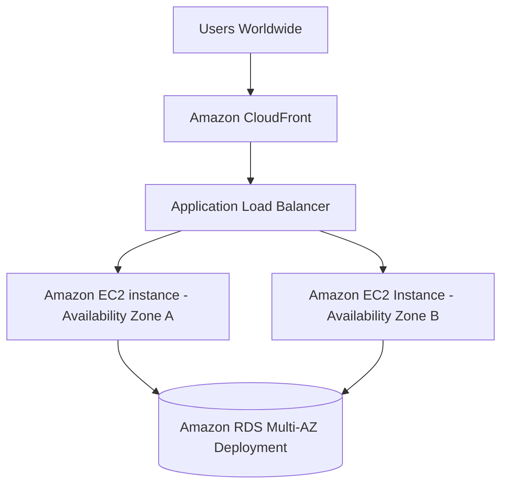
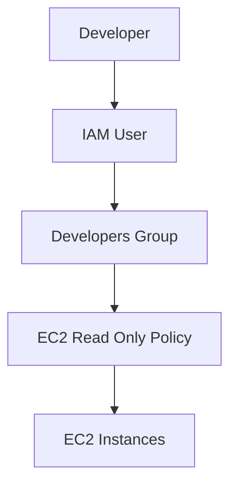
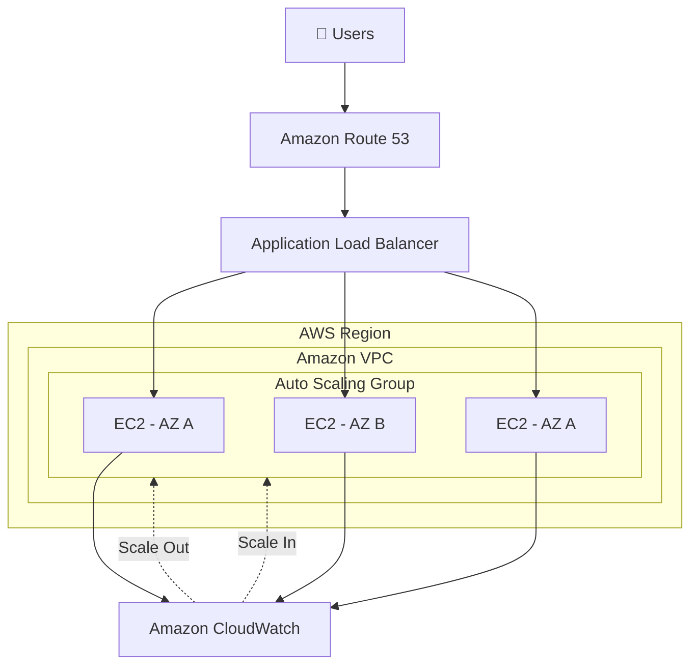
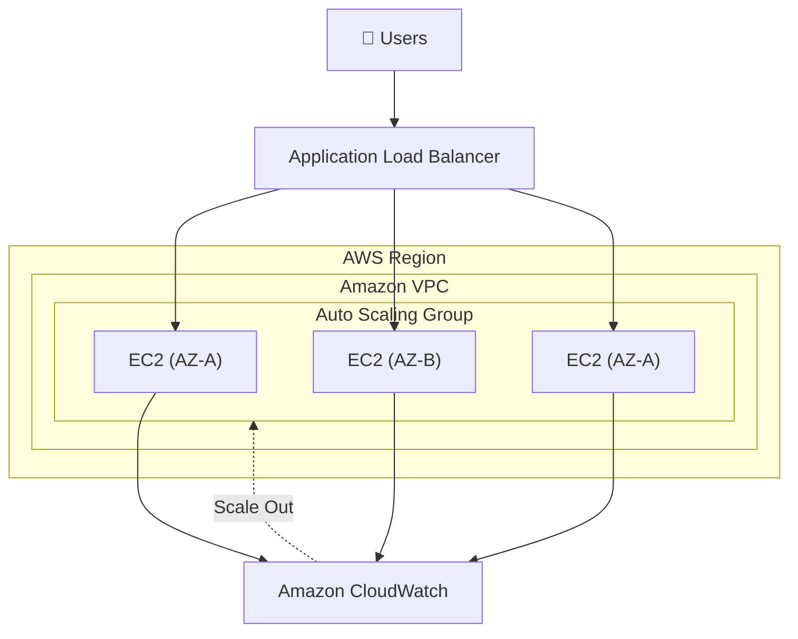
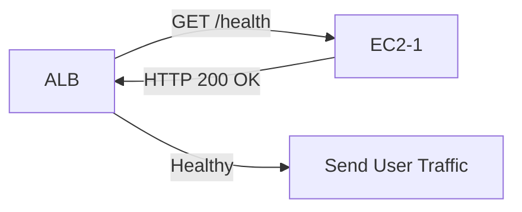
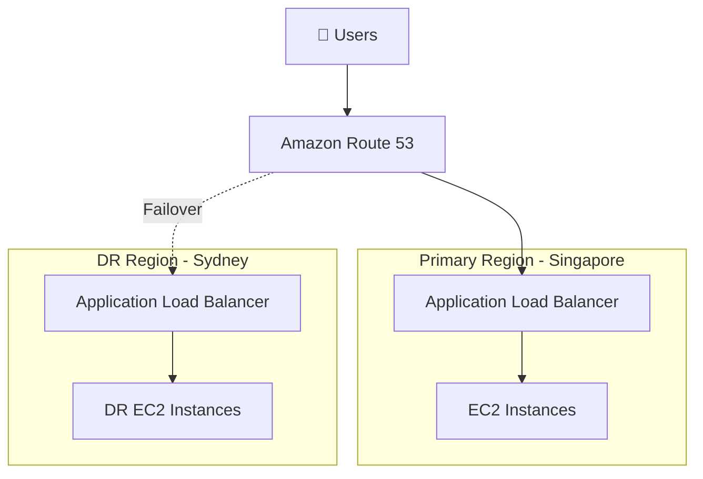
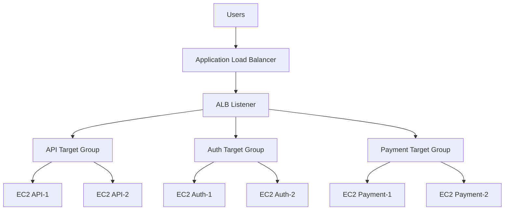

## AWS Highly Available Web Application 

```mermaid
graph TD

A[Users Worldwide]
B[Amazon CloudFront]
C[Application Load Balancer]
D[Amazon EC2 instance - Availability Zone A]
E[Amazon EC2 Instance - Availability Zone B]
F[(Amazon RDS Multi-AZ Deployment)]

A --> B
B --> C
C --> D
C --> E
D --> F
E --> F
```

```mermaid
flowchart TD

User[Developer]

User --> IAM[IAM User]

IAM --> Group[Developers Group]

Group --> Policy[EC2 Read Only Policy]

Policy --> AWS[EC2 Instances]
```

```mermaid
flowchart TD

User[Developer]

User --> IAM[IAM User]

IAM --> Group[Developers Group]

Group --> Policy[EC2 Read Only Policy]

Policy --> AWS[EC2 Instances]
```

## AWS Auto Scaling Groups

```mermaid
flowchart TD

    U[👥 Users]
    DNS[Amazon Route 53]
    ALB[Application Load Balancer]

    subgraph AWS["AWS Region"]

        subgraph VPC["Amazon VPC"]

            subgraph ASG["Auto Scaling Group"]

                EC1[EC2 - AZ A]
                EC2[EC2 - AZ B]
                EC3[EC2 - AZ A]

            end

        end

    end

    CW[Amazon CloudWatch]

    U --> DNS
    DNS --> ALB

    ALB --> EC1
    ALB --> EC2
    ALB --> EC3

    EC1 --> CW
    EC2 --> CW
    EC3 --> CW

    CW -. Scale Out .-> ASG
    CW -. Scale In .-> ASG
```

Diagram 1 – ALB + ASG

```mermaid
flowchart TD

    U[👥 Users]
    ALB[Application Load Balancer]

    subgraph AWS["AWS Region"]

        subgraph VPC["Amazon VPC"]

            subgraph ASG["Auto Scaling Group"]

                EC1["EC2 (AZ-A)"]
                EC2["EC2 (AZ-B)"]
                EC3["EC2 (AZ-A)"]

            end

        end

    end

    CW["Amazon CloudWatch"]

    U --> ALB

    ALB --> EC1
    ALB --> EC2
    ALB --> EC3

    EC1 --> CW
    EC2 --> CW
    EC3 --> CW

    CW -. Scale Out .-> ASG
```

Diagram 2 – ALB Health Check

```mermaid
flowchart LR

ALB -->|"GET /health"| EC1["EC2-1"]

EC1 -->|"HTTP 200 OK"| ALB

ALB -->|"Healthy"| USERS[Send User Traffic]
```

Diagram 3 – Regional DR

```mermaid
flowchart TD

    Users[👥 Users]
    Route53[Amazon Route 53]

    subgraph Primary["Primary Region - Singapore"]
        ALB1[Application Load Balancer]
        EC2A[EC2 Instances]
        ALB1 --> EC2A
    end

    subgraph DR["DR Region - Sydney"]
        ALB2[Application Load Balancer]
        EC2B[DR EC2 Instances]
        ALB2 --> EC2B
    end

    Users --> Route53
    Route53 --> ALB1

    Route53 -. "Failover" .-> ALB2
```

**A. ALB + Target Groups**

```mermaid
flowchart TD

    Users[Users]

    ALB[Application Load Balancer]
    Listener[ALB Listener]

    API[API Target Group]
    AUTH[Auth Target Group]
    PAYMENT[Payment Target Group]

    API1[EC2 API-1]
    API2[EC2 API-2]

    AUTH1[EC2 Auth-1]
    AUTH2[EC2 Auth-2]

    PAY1[EC2 Payment-1]
    PAY2[EC2 Payment-2]

    Users --> ALB
    ALB --> Listener

    Listener --> API
    Listener --> AUTH
    Listener --> PAYMENT

    API --> API1
    API --> API2

    AUTH --> AUTH1
    AUTH --> AUTH2

    PAYMENT --> PAY1
    PAYMENT --> PAY2

```
