## AWS Highly Available Web Application 

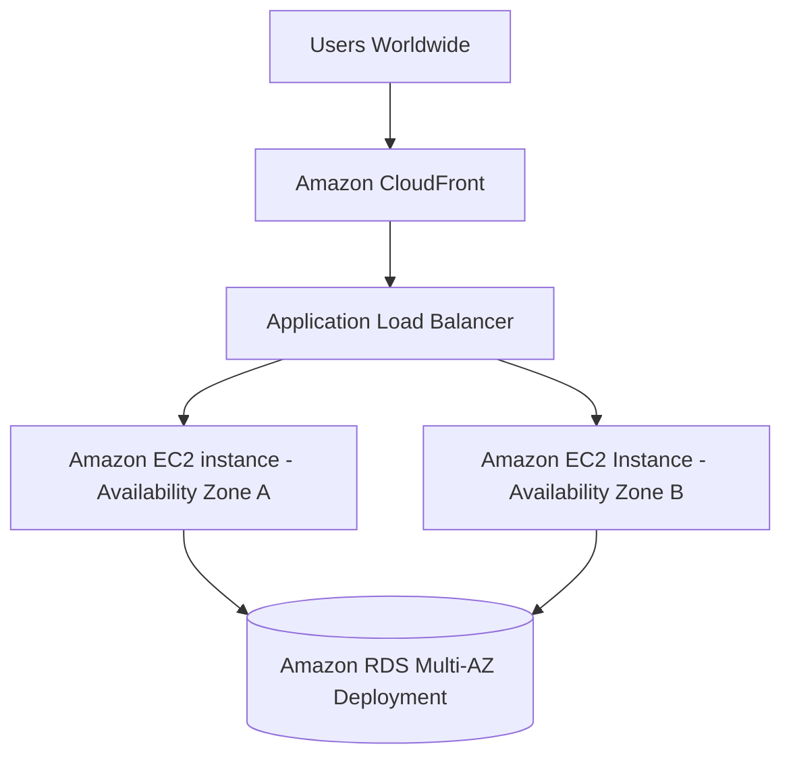
```mermaid
graph TD

A[Users Worldwide]
B[Amazon CloudFront]
C[Application Load Balancer]
D[Amazon EC2 instance - Availability Zone A]
E[Amazon EC2 Instance - Availability Zone B]
F[(Amazon RDS Multi-AZ Deployment)]

A --> B
B --> C
C --> D
C --> E
D --> F
E --> F
```

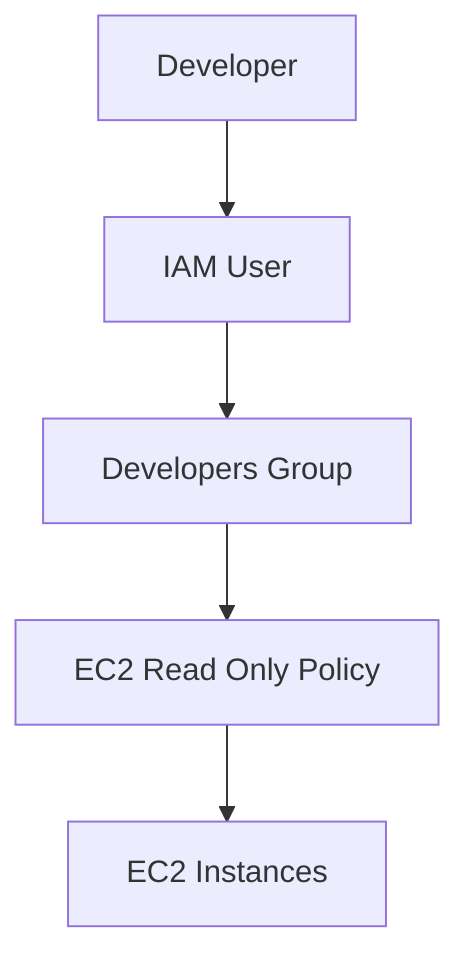
```mermaid
flowchart TD

User[Developer]

User --> IAM[IAM User]

IAM --> Group[Developers Group]

Group --> Policy[EC2 Read Only Policy]

Policy --> AWS[EC2 Instances]
```

```mermaid
flowchart TD

User[Developer]

User --> IAM[IAM User]

IAM --> Group[Developers Group]

Group --> Policy[EC2 Read Only Policy]

Policy --> AWS[EC2 Instances]
```

## AWS Auto Scaling Groups

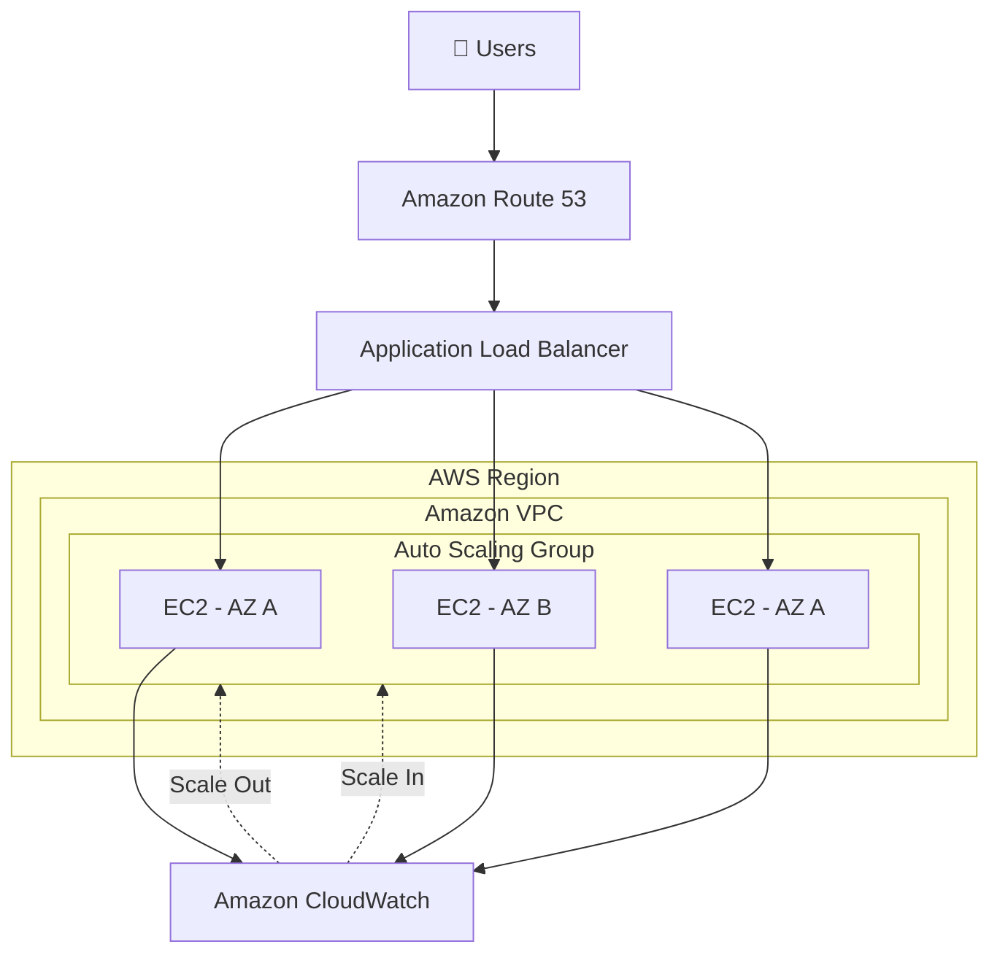
```mermaid
flowchart TD

    U[👥 Users]
    DNS[Amazon Route 53]
    ALB[Application Load Balancer]

    subgraph AWS["AWS Region"]

        subgraph VPC["Amazon VPC"]

            subgraph ASG["Auto Scaling Group"]

                EC1[EC2 - AZ A]
                EC2[EC2 - AZ B]
                EC3[EC2 - AZ A]

            end

        end

    end

    CW[Amazon CloudWatch]

    U --> DNS
    DNS --> ALB

    ALB --> EC1
    ALB --> EC2
    ALB --> EC3

    EC1 --> CW
    EC2 --> CW
    EC3 --> CW

    CW -. Scale Out .-> ASG
    CW -. Scale In .-> ASG
```

Diagram 1 – ALB + ASG

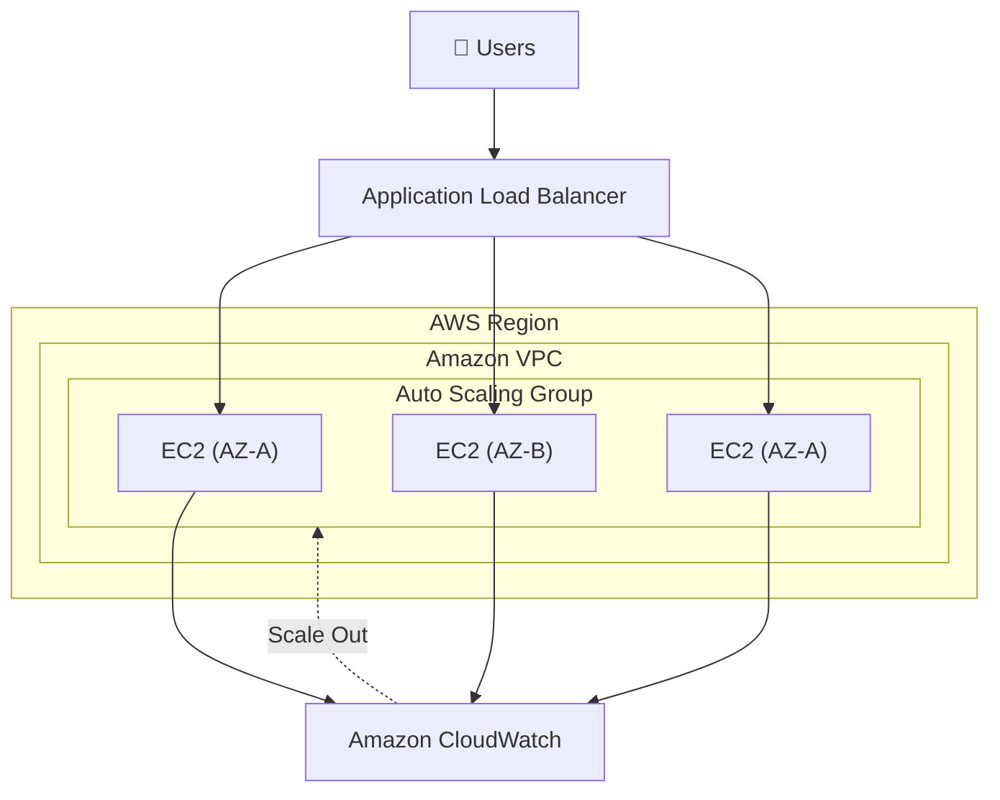
```mermaid
flowchart TD

    U[👥 Users]
    ALB[Application Load Balancer]

    subgraph AWS["AWS Region"]

        subgraph VPC["Amazon VPC"]

            subgraph ASG["Auto Scaling Group"]

                EC1["EC2 (AZ-A)"]
                EC2["EC2 (AZ-B)"]
                EC3["EC2 (AZ-A)"]

            end

        end

    end

    CW["Amazon CloudWatch"]

    U --> ALB

    ALB --> EC1
    ALB --> EC2
    ALB --> EC3

    EC1 --> CW
    EC2 --> CW
    EC3 --> CW

    CW -. Scale Out .-> ASG
```

Diagram 2 – ALB Health Check

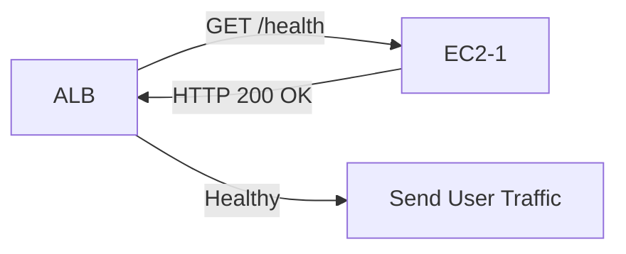
```mermaid
flowchart LR

ALB -->|"GET /health"| EC1["EC2-1"]

EC1 -->|"HTTP 200 OK"| ALB

ALB -->|"Healthy"| USERS[Send User Traffic]
```

Diagram 3 – Regional DR

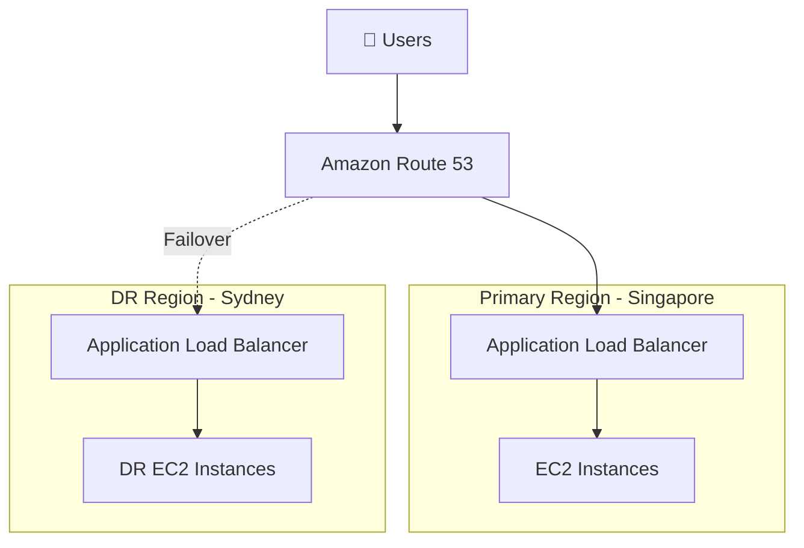
```mermaid
flowchart TD

    Users[👥 Users]
    Route53[Amazon Route 53]

    subgraph Primary["Primary Region - Singapore"]
        ALB1[Application Load Balancer]
        EC2A[EC2 Instances]
        ALB1 --> EC2A
    end

    subgraph DR["DR Region - Sydney"]
        ALB2[Application Load Balancer]
        EC2B[DR EC2 Instances]
        ALB2 --> EC2B
    end

    Users --> Route53
    Route53 --> ALB1

    Route53 -. "Failover" .-> ALB2
```

**A. ALB + Target Groups**

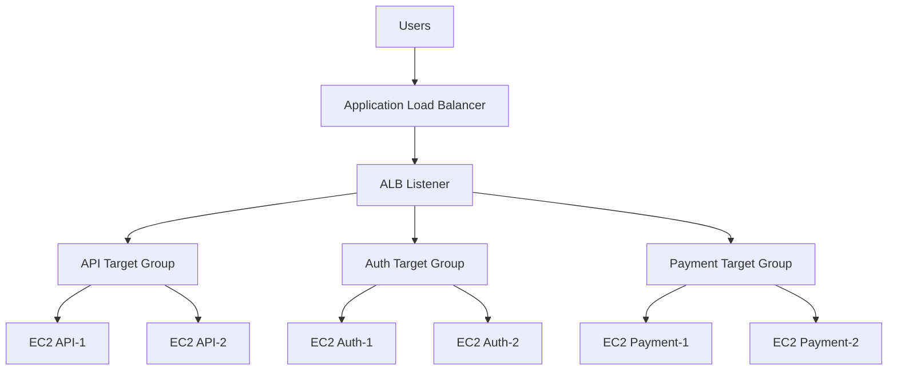
```mermaid
flowchart TD

    Users[Users]

    ALB[Application Load Balancer]
    Listener[ALB Listener]

    API[API Target Group]
    AUTH[Auth Target Group]
    PAYMENT[Payment Target Group]

    API1[EC2 API-1]
    API2[EC2 API-2]

    AUTH1[EC2 Auth-1]
    AUTH2[EC2 Auth-2]

    PAY1[EC2 Payment-1]
    PAY2[EC2 Payment-2]

    Users --> ALB
    ALB --> Listener

    Listener --> API
    Listener --> AUTH
    Listener --> PAYMENT

    API --> API1
    API --> API2

    AUTH --> AUTH1
    AUTH --> AUTH2

    PAYMENT --> PAY1
    PAYMENT --> PAY2

```

**B. Path-Based Routing**

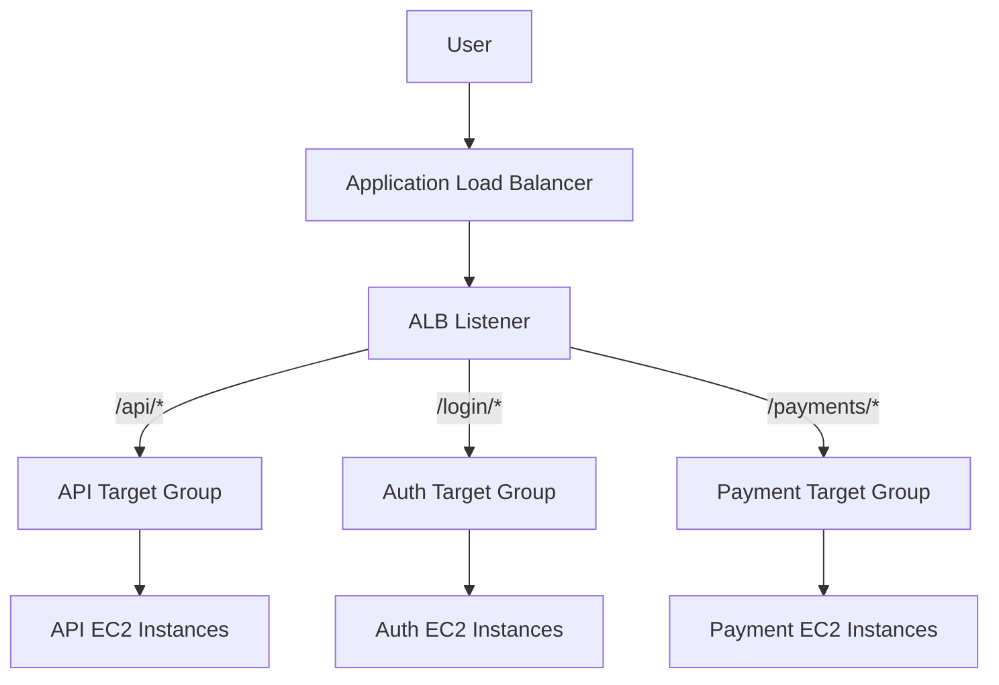
```mermaid

flowchart TD

    User[User]
    ALB[Application Load Balancer]
    Listener[ALB Listener]

    API[API Target Group]
    AUTH[Auth Target Group]
    PAYMENT[Payment Target Group]

    APIEC2[API EC2 Instances]
    AUTHEC2[Auth EC2 Instances]
    PAYEC2[Payment EC2 Instances]

    User --> ALB
    ALB --> Listener

    Listener -->|"/api/*"| API
    Listener -->|"/login/*"| AUTH
    Listener -->|"/payments/*"| PAYMENT

    API --> APIEC2
    AUTH --> AUTHEC2
    PAYMENT --> PAYEC2

```

**C. Host-Based Routing**

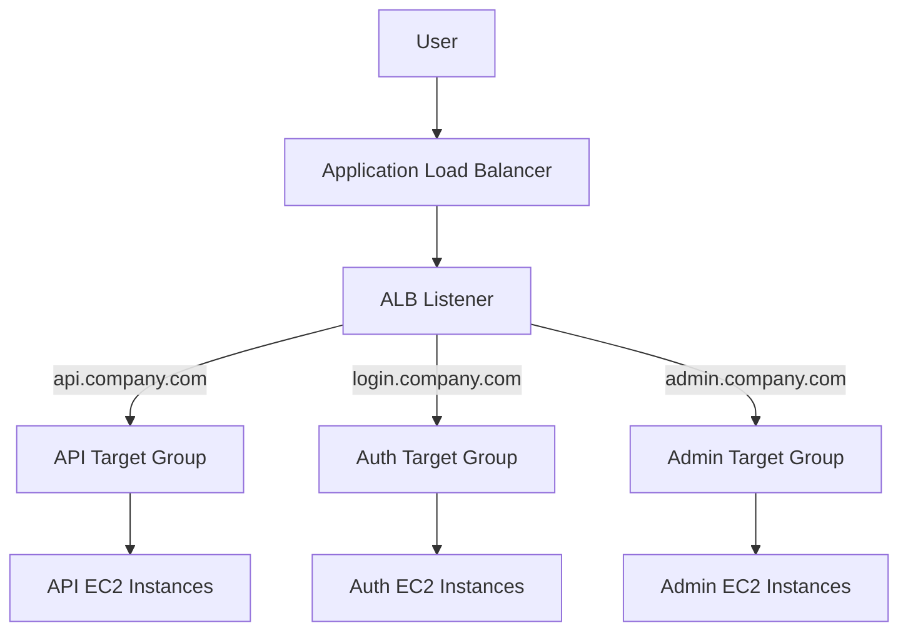
```mermaid
flowchart TD

    User[User]
    ALB[Application Load Balancer]
    Listener[ALB Listener]

    API[API Target Group]
    AUTH[Auth Target Group]
    ADMIN[Admin Target Group]

    APIEC2[API EC2 Instances]
    AUTHEC2[Auth EC2 Instances]
    ADMINEC2[Admin EC2 Instances]

    User --> ALB
    ALB --> Listener

    Listener -->|"api.company.com"| API
    Listener -->|"login.company.com"| AUTH
    Listener -->|"admin.company.com"| ADMIN

    API --> APIEC2
    AUTH --> AUTHEC2
    ADMIN --> ADMINEC2

```

**D. Blue/Green Deployment**

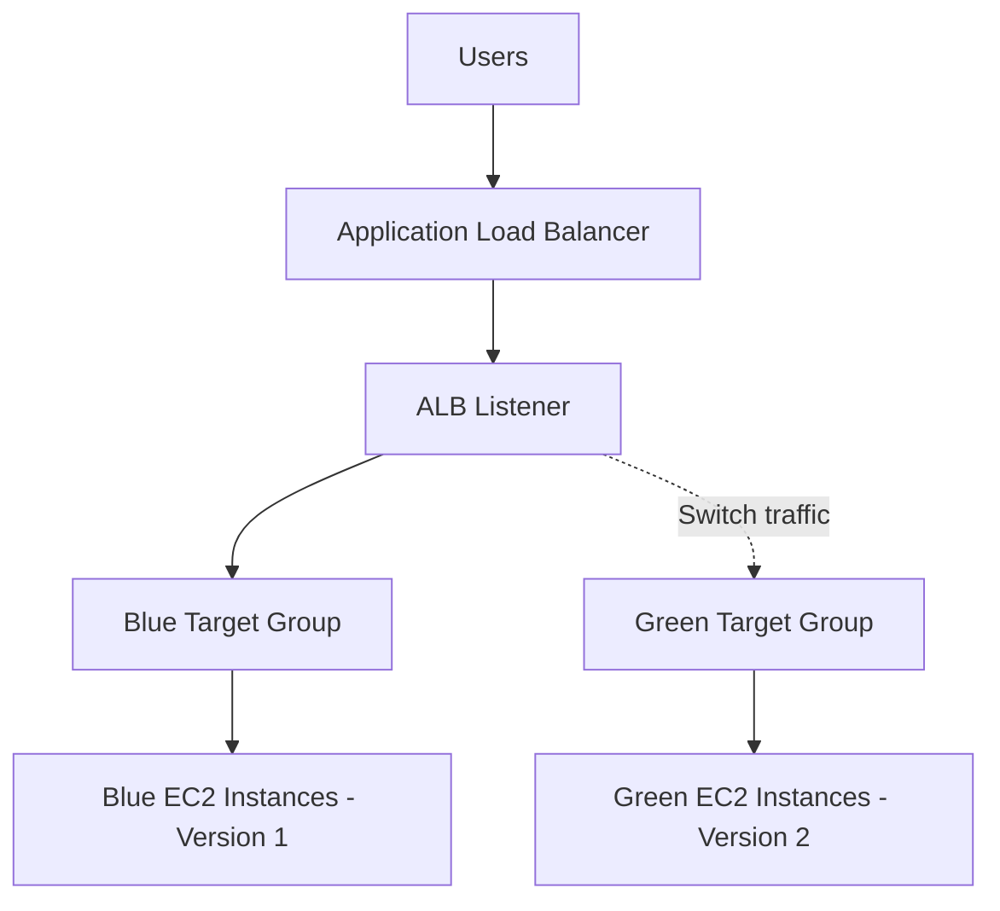
```mermaid
flowchart TD

    Users[Users]
    ALB[Application Load Balancer]
    Listener[ALB Listener]

    BLUE[Blue Target Group]
    GREEN[Green Target Group]

    BLUEEC2[Blue EC2 Instances - Version 1]
    GREENEC2[Green EC2 Instances - Version 2]

    Users --> ALB
    ALB --> Listener

    Listener --> BLUE
    Listener -. "Switch traffic" .-> GREEN

    BLUE --> BLUEEC2
    GREEN --> GREENEC2

```

---

# 2. `architecture/aws/README.md`

Add this section:

## CloudFront Architecture

### A. CloudFront + S3

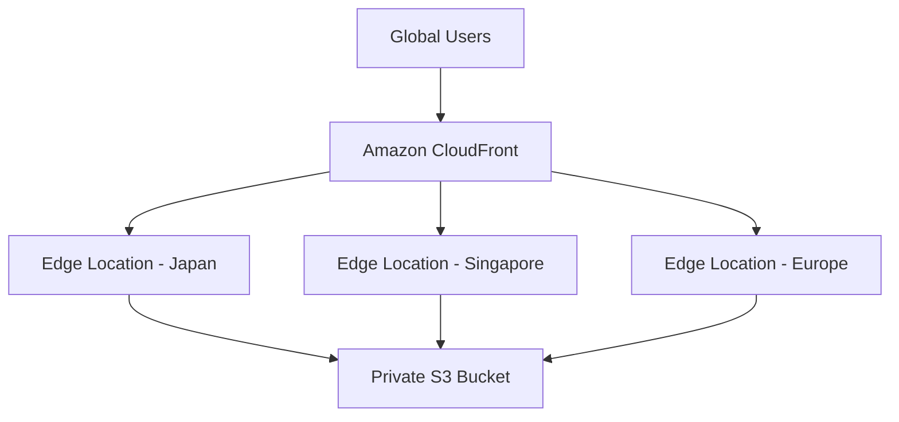
```mermaid
flowchart TD

    Users[Global Users]

    CF[Amazon CloudFront]

    Edge1[Edge Location - Japan]
    Edge2[Edge Location - Singapore]
    Edge3[Edge Location - Europe]

    S3[Private S3 Bucket]

    Users --> CF

    CF --> Edge1
    CF --> Edge2
    CF --> Edge3

    Edge1 --> S3
    Edge2 --> S3
    Edge3 --> S3

```

**B. CloudFront + ALB + ASG**

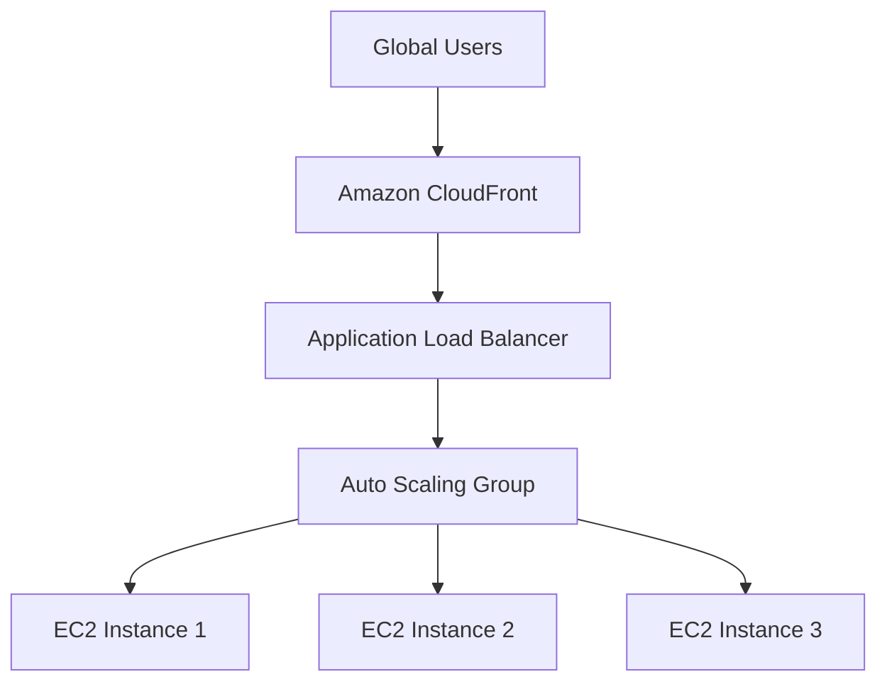
```mermaid
flowchart TD

    Users[Global Users]

    CF[Amazon CloudFront]

    ALB[Application Load Balancer]

    ASG[Auto Scaling Group]

    EC1[EC2 Instance 1]
    EC2[EC2 Instance 2]
    EC3[EC2 Instance 3]

    Users --> CF
    CF --> ALB
    ALB --> ASG

    ASG --> EC1
    ASG --> EC2
    ASG --> EC3

```

**C. CloudFront Static + Dynamic Content**
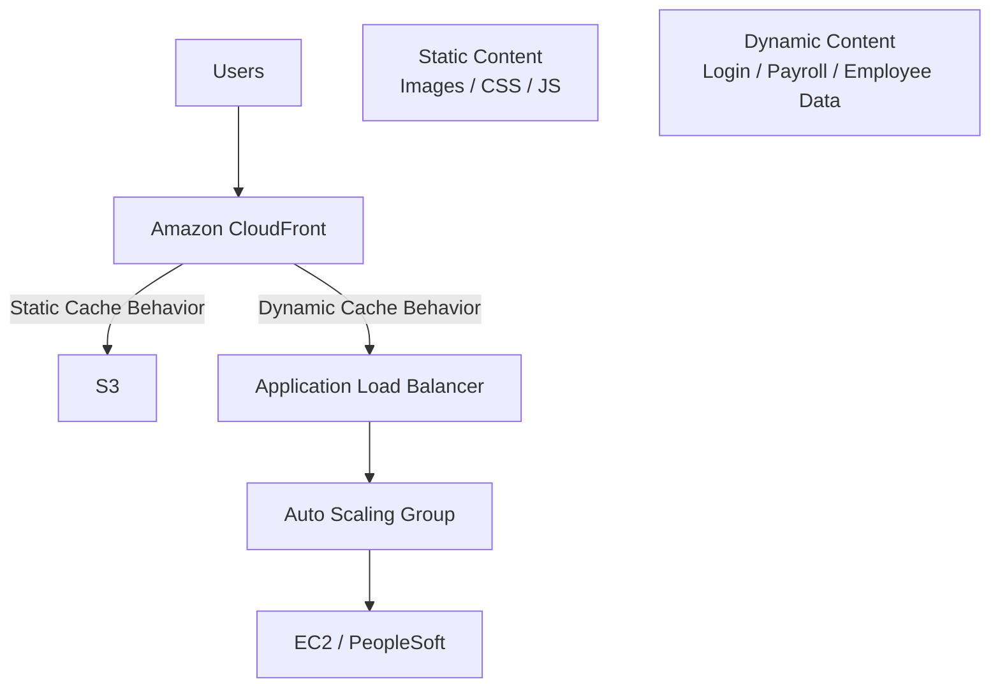
```mermaid
flowchart TD

    Users[Users]

    CF[Amazon CloudFront]

    Static[Static Content<br/>Images / CSS / JS]
    Dynamic[Dynamic Content<br/>Login / Payroll / Employee Data]

    S3[S3]
    ALB[Application Load Balancer]
    ASG[Auto Scaling Group]
    EC2[EC2 / PeopleSoft]

    Users --> CF

    CF -->|Static Cache Behavior| S3
    CF -->|Dynamic Cache Behavior| ALB

    ALB --> ASG
    ASG --> EC2

```

**D. CloudFront + Private S3 + OAC**
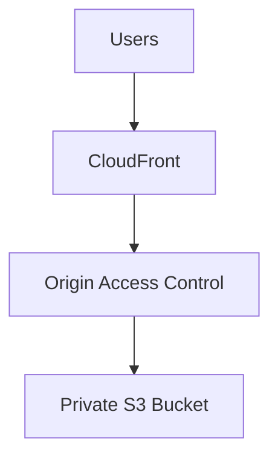
```mermaid
flowchart TD

    Users[Users]

    CF[CloudFront]

    OAC[Origin Access Control]

    S3[Private S3 Bucket]

    Users --> CF
    CF --> OAC
    OAC --> S3

```

A. Route 53 + ALB
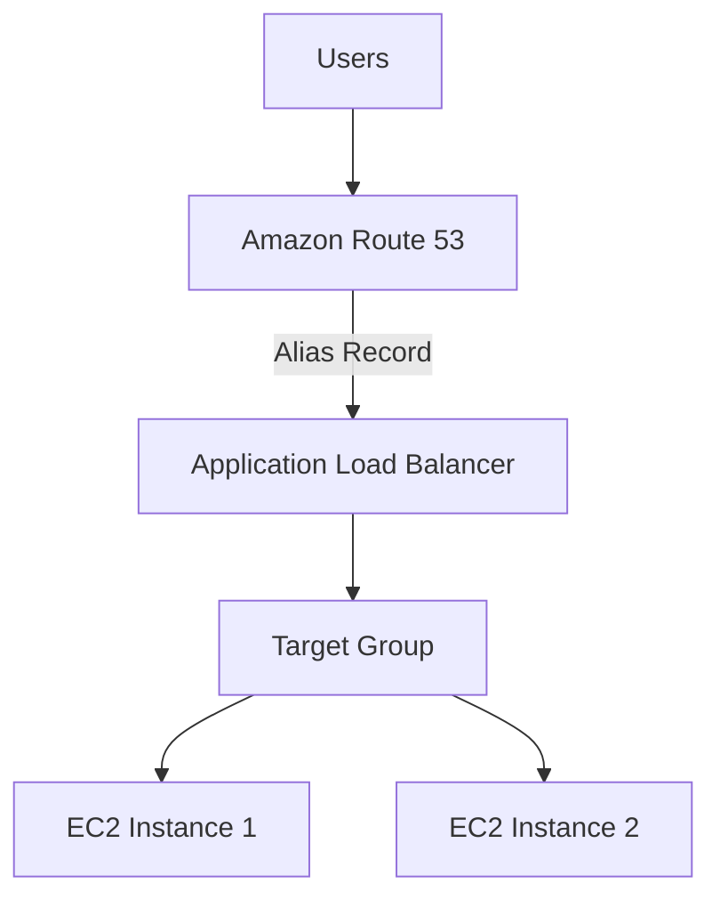
```mermaid
flowchart TD

    Users[Users]

    R53[Amazon Route 53]

    ALB[Application Load Balancer]

    TG[Target Group]

    EC1[EC2 Instance 1]
    EC2[EC2 Instance 2]

    Users --> R53
    R53 -->|Alias Record| ALB
    ALB --> TG
    TG --> EC1
    TG --> EC2

```

B. Route 53 + CloudFront + ALB

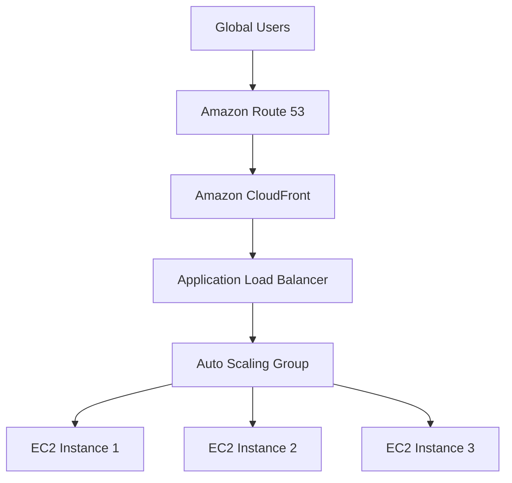
```mermaid

flowchart TD

    Users[Global Users]

    R53[Amazon Route 53]

    CF[Amazon CloudFront]

    ALB[Application Load Balancer]

    ASG[Auto Scaling Group]

    EC1[EC2 Instance 1]
    EC2[EC2 Instance 2]
    EC3[EC2 Instance 3]

    Users --> R53
    R53 --> CF
    CF --> ALB
    ALB --> ASG

    ASG --> EC1
    ASG --> EC2
    ASG --> EC3
```

C. Route 53 Failover Routing

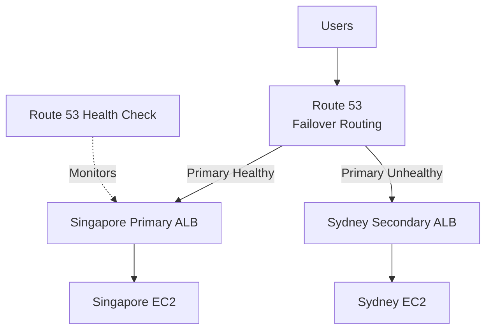
```mermaid
flowchart TD

    Users[Users]

    R53[Route 53<br/>Failover Routing]

    Health[Route 53 Health Check]

    SG[Singapore Primary ALB]
    SY[Sydney Secondary ALB]

    SGEC2[Singapore EC2]
    SYEC2[Sydney EC2]

    Users --> R53

    Health -. Monitors .-> SG

    R53 -->|Primary Healthy| SG
    R53 -->|Primary Unhealthy| SY

    SG --> SGEC2
    SY --> SYEC2

```

D. Route 53 Weighted Routing

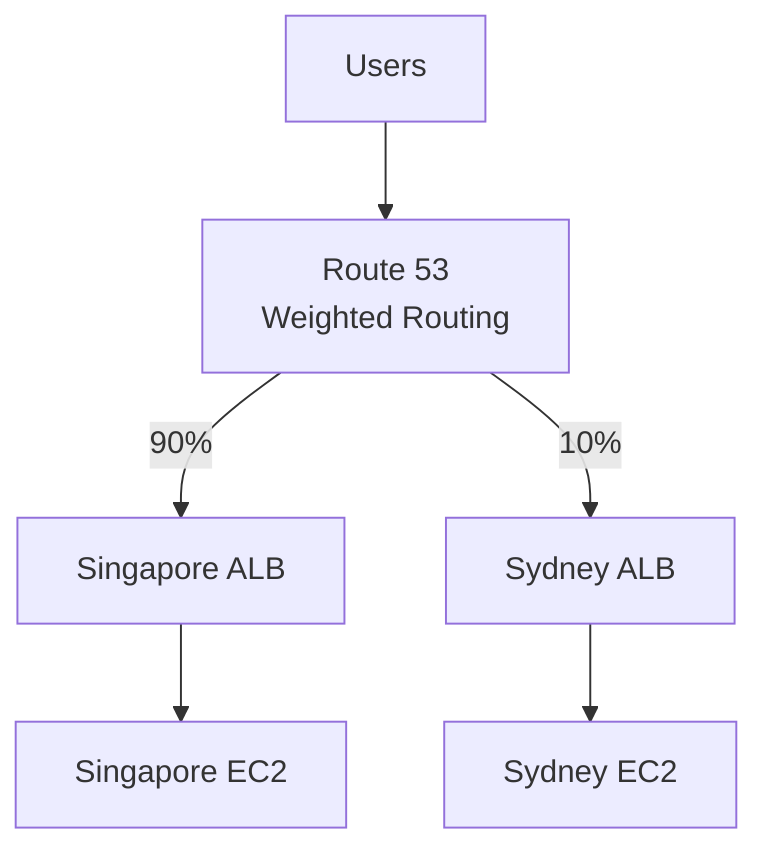
```mermaid
flowchart TD

    Users[Users]

    R53[Route 53<br/>Weighted Routing]

    SG[Singapore ALB]
    SY[Sydney ALB]

    SGEC2[Singapore EC2]
    SYEC2[Sydney EC2]

    Users --> R53

    R53 -->|90%| SG
    R53 -->|10%| SY

    SG --> SGEC2
    SY --> SYEC2
```

E. Route 53 Latency-Based Routing

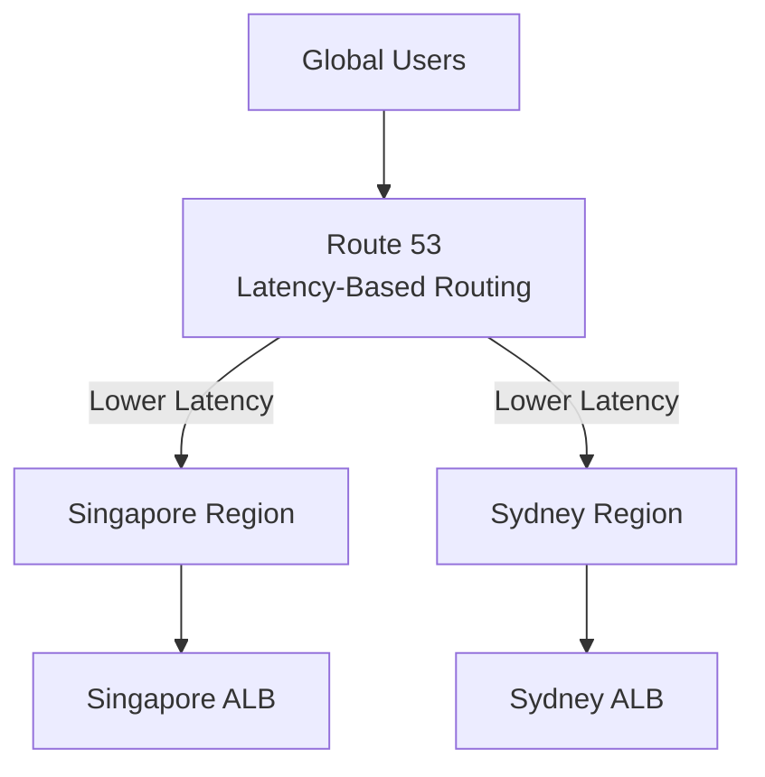
```mermaid

flowchart TD

    Users[Global Users]

    R53[Route 53<br/>Latency-Based Routing]

    SG[Singapore Region]
    SY[Sydney Region]

    SGALB[Singapore ALB]
    SYALB[Sydney ALB]

    Users --> R53

    R53 -->|Lower Latency| SG
    R53 -->|Lower Latency| SY

    SG --> SGALB
    SY --> SYALB
```

F. Route 53 Geolocation Routing

```mermaid

flowchart TD

    Users[Global Users]

    R53[Route 53<br/>Geolocation Routing]

    SG[Singapore Application]
    JP[Japan Application]
    UK[UK Application]

    Users --> R53

    R53 -->|Singapore Users| SG
    R53 -->|Japan Users| JP
    R53 -->|UK Users| UK

```

