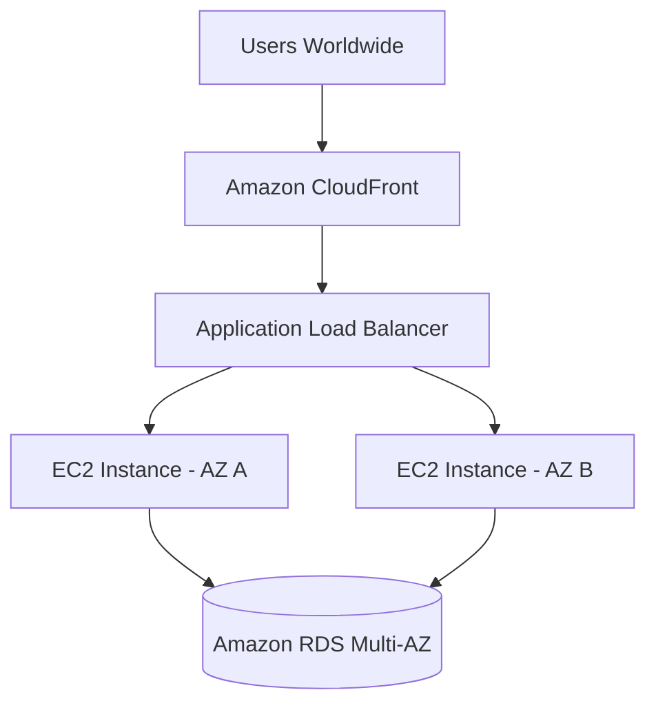

## AWS Highly Available Web Application

```mermaid
graph TD

A[Users Worldwide]
B[Amazon CloudFront]
C[Application Load Balancer]
D[EC2 Instance - AZ A]
E[EC2 Instance - AZ B]
F[(Amazon RDS Multi-AZ)]

A --> B
B --> C
C --> D
C --> E
D --> F
E --> F
```
