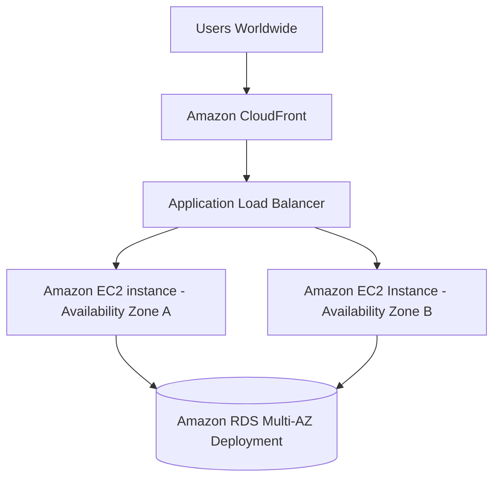
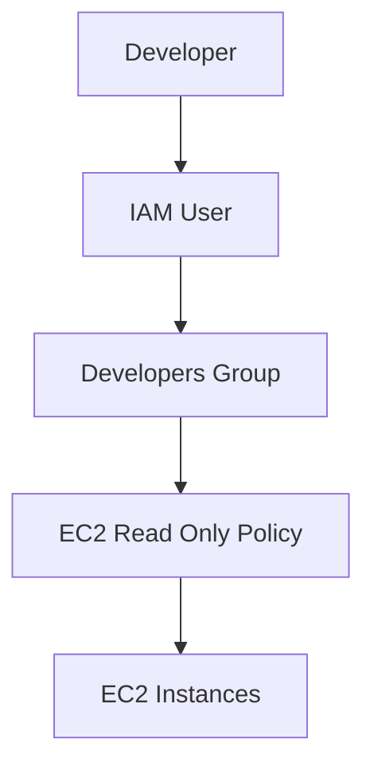
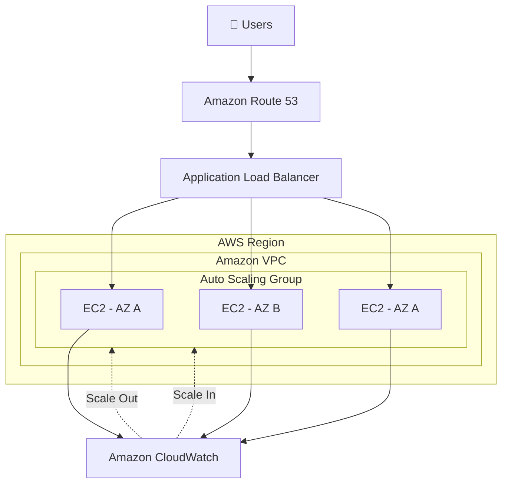
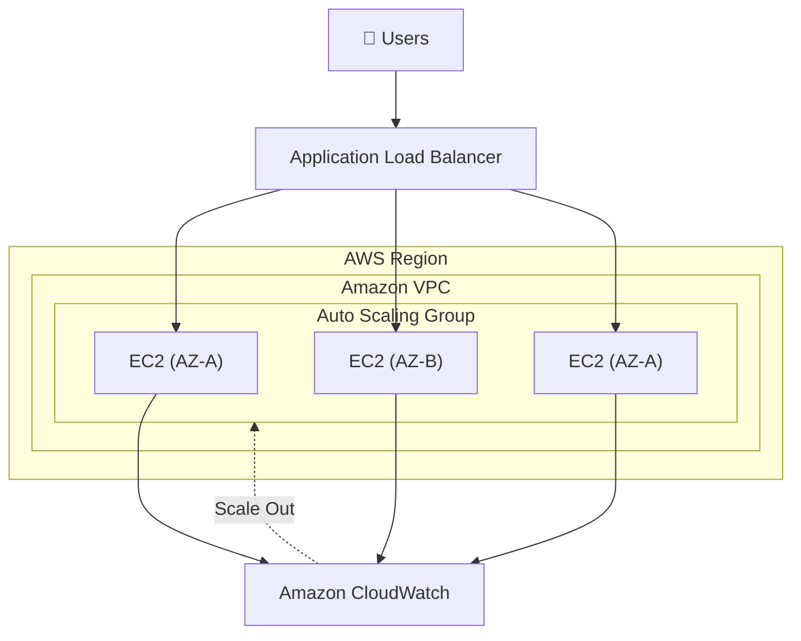
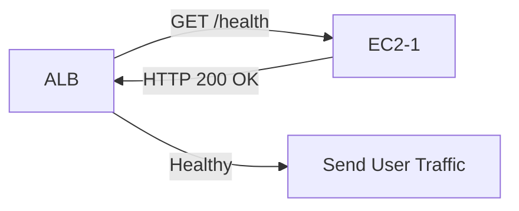

## AWS Highly Available Web Application 







## AWS Auto Scaling Groups




Diagram 1 – ALB + ASG




Diagram 2 – ALB Health Check




Diagram 3 – Regional DR

```mermaid
flowchart TD

Users

↓

Route53

↓

Singapore ALB

Sydney ALB

Singapore ALB --> EC2A["EC2 Instances"]

Sydney ALB --> EC2B["DR EC2 Instances"]

Route53 -. Failover .-> Sydney ALB
```

